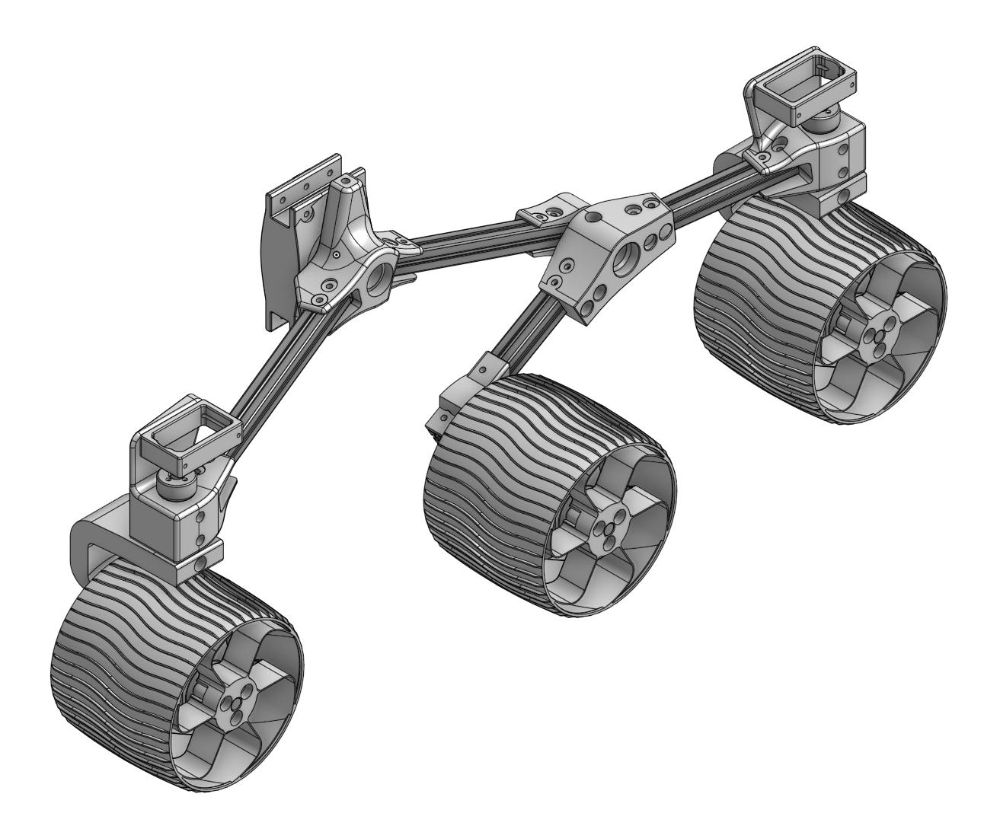

# Sawppy the Six-Wheeled Rover

Sawppy Rover was inspired by SGVHAK Rover, a six-wheeled robot inspired by the NASA JPL rovers sent to explore Mars. The major differences between Sawppy and the SGVHAK Rover were motivated by a desire to reduce cost and complexity. To accomplish this goal, design for Sawppy differs in two major design goals:

* Motorization: Instead of using gearmotors with encoders managed by RoboClaw motor controllers, moving the wheels will be done with servo motors.
* Construction Method: Instead of using the [Actobotics construction system](https://www.servocity.com/actobotics), Sawppy will be built from [Misumi HFS3 aluminum extrusions](https://us.misumi-ec.com/vona2/detail/110300465870/) connected by 3D-printed plastic parts

These two major design goals can be summarized as: **S**ervo **A**ctuated **W**heels, **P**rinted **I**nterconnect **F**or **E**xtrusion. The acronym SAWPIFE led to the nickedname "Sawppy".

# Project Status

The first version is under active development. Here is a snapshot of what we have so far:

Anyone interested is invited to create an [Onshape](https://www.onshape.com/) account and look at it in Onshape CAD. Search for "SAWPIFE Rover" in the Onshape Public Documents library or try [this link](https://cad.onshape.com/documents/43678ef564a43281c83e1aef/w/392bbf8745395bc24367a35c/e/769331aa3366fde1dddae054).
