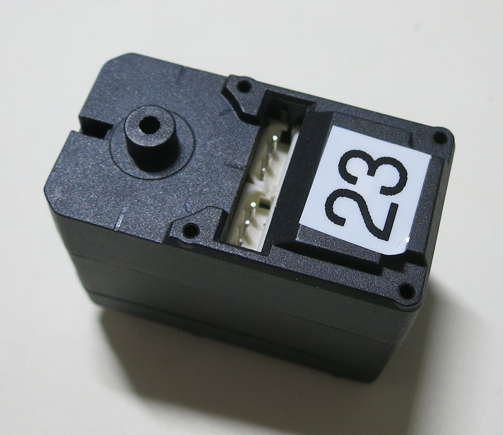
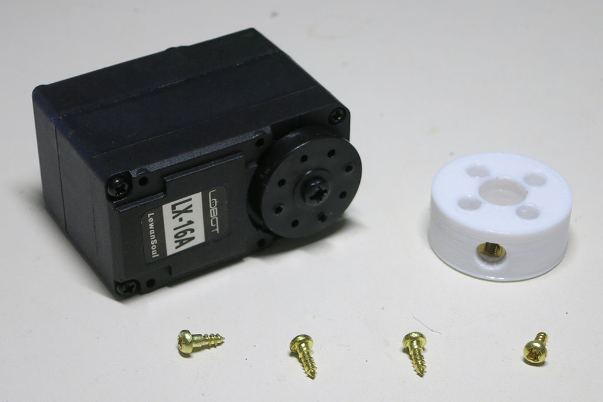
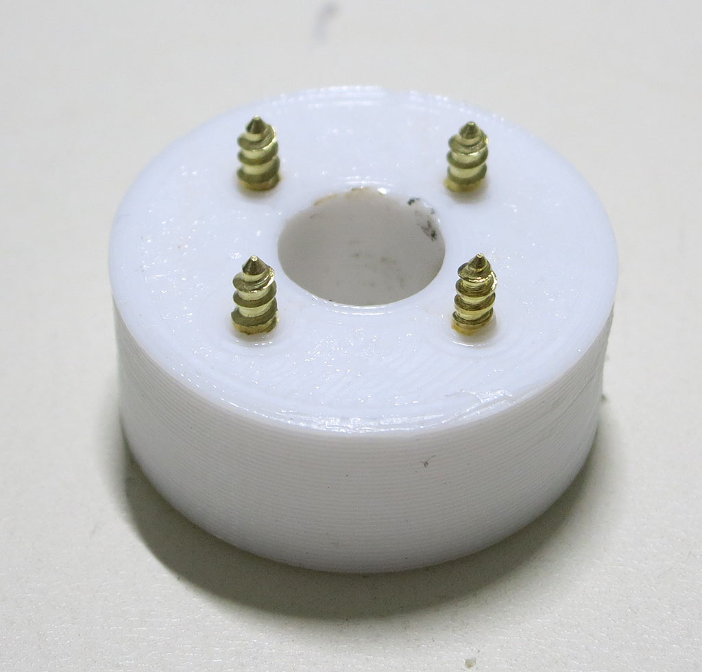
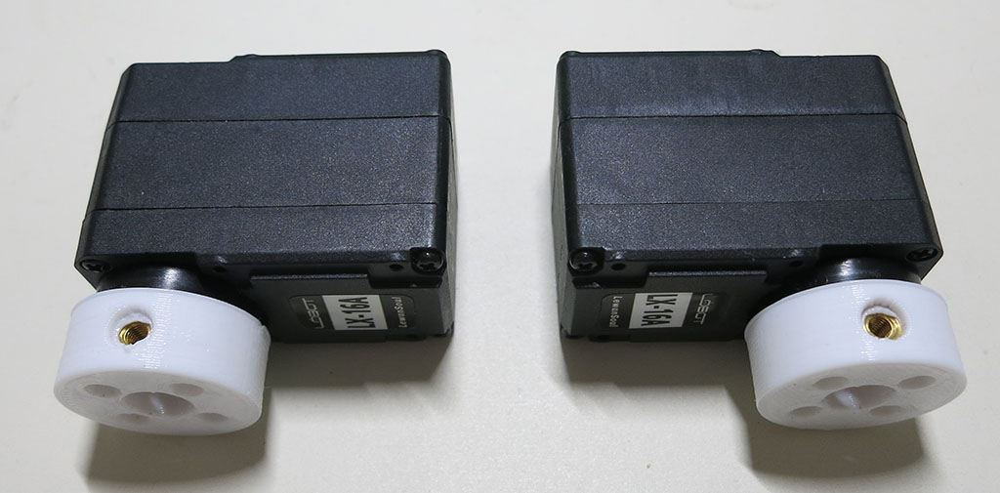
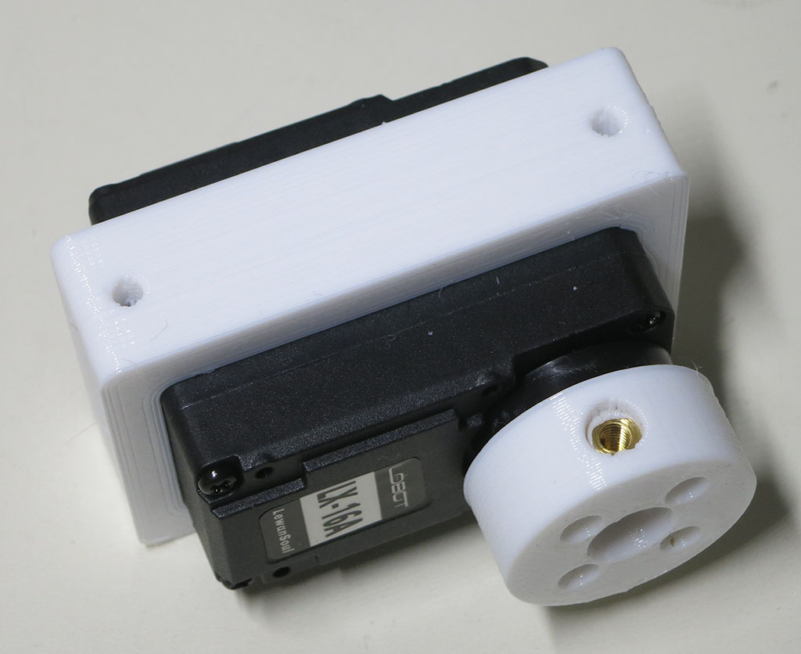

# Servo Actuator Module Assembly

These instructions prepare a serial bus servo for integration into an actuator module for Sawppy the Rover.

**Estimated Time**: 6 minutes per module * 10 modules = 1 hour total.

## Servo preparation

10 serial bus servos are used to control Sawppy the Rover - 4 for steering each of the corner wheels,
and 6 to drive each of the wheels. A few preparatory steps should be taken before integration with printed parts.

These servos are assigned to a default address from the factory. They need to be assigned unique
addresses that do not conflict with any other servo on the same serial bus. Consult the manual
for details. After an address is assigned, label the servo with its address for later identification.
The servo address reassignment tool should also allow you to do a quick test to verify that the
servo works properly. After you test servo motion, be sure to reset back to center position before
disconnecting power. This will be important when setting up the steering servos in the next step.

## Install shaft coupler

**Parts:**
* Serial bus servo
* [Servo shaft coupler](Print%20Servo%20Parts.md)
* 4 * installation screws. The serial bus servo comes with some installation screws, but they have proven
to be too short for long-term durability. The fastener used in the pictures below are [McMaster-Carr #98685A220](https://www.mcmaster.com/#98685a220)
1/4" long Philips #2 brass screw.

Verify that the 3D-printed coupler is free of printer debris and is of proper dimensions by installing
the screws and verify they can extend far enough for the threads to properly engage the servo horn.

Once verified, install the coupler onto the servo horn. For the four steering servos, they need to be
at (or at least close) to their center position. The coupler should then be installed so two of them have
the set screw facing one side and two of them have set screw pointing to the other side.

For the six driving servos, coupler set screw orientation does not matter.

Slide the bracket over the servo to complete a servo actuator module for Sawppy the Rover.

Repeat procedure for a total of ten modules.

