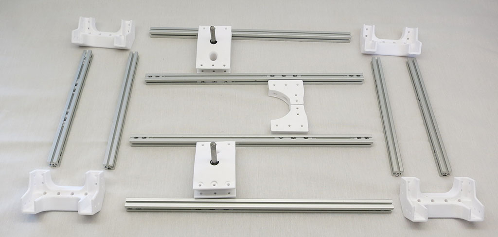
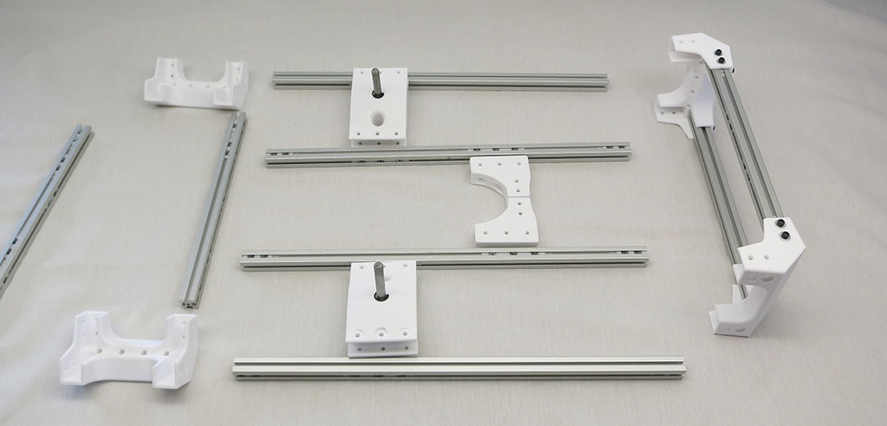
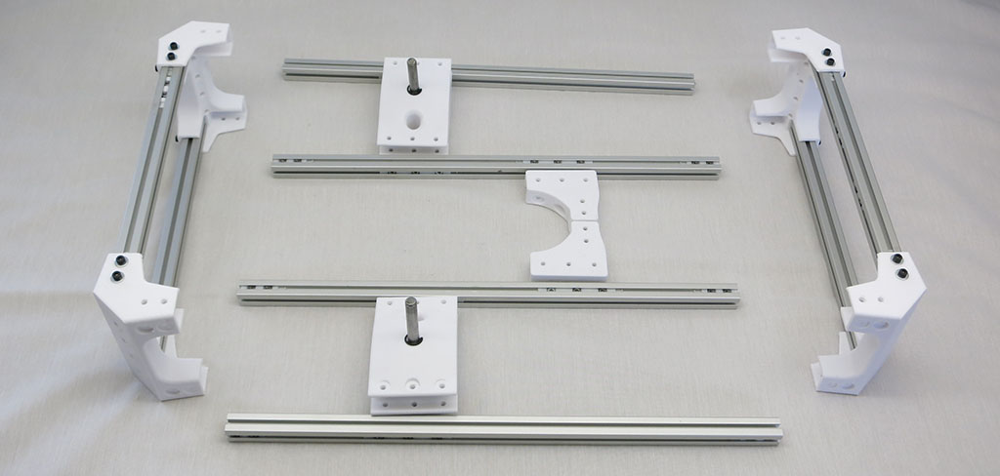
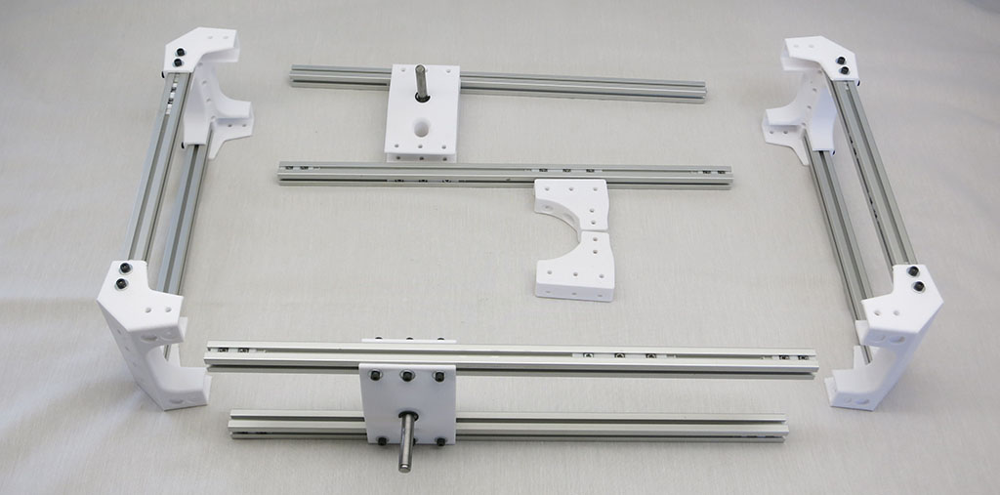
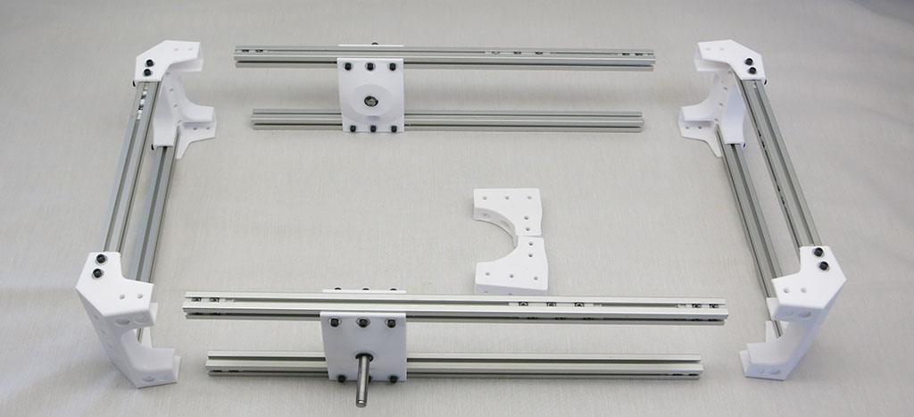
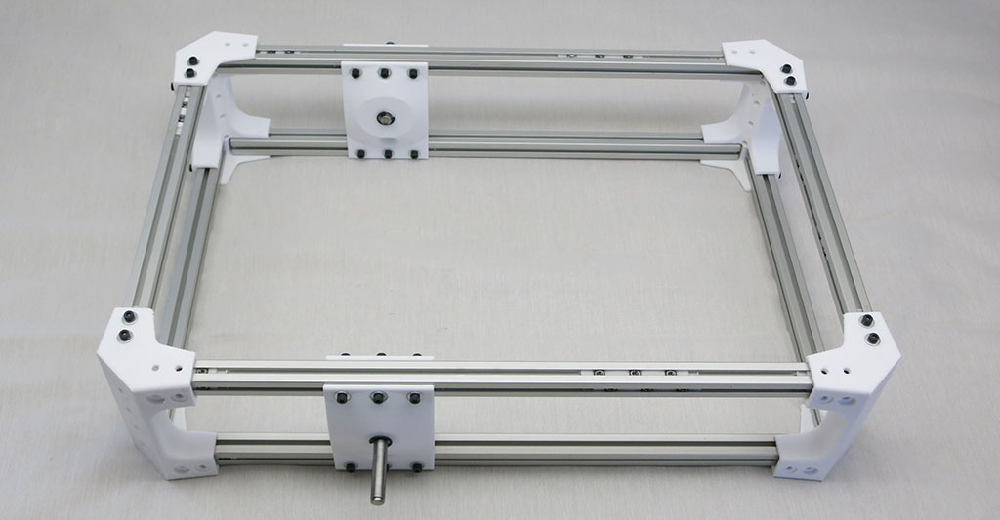

# Body Assembly

These parts make up the box that serves as the rover's main body and equipment bay.

**Estimated Time:** 1 hour 15 minutes

**Parts:**
* 4 * [Printed corner pieces0(Print%20Body%20Box%20Corners.md)
* 4 * [385mm extrusion beams](Misumi%20HFS%203.md)
* 4 * [245mm extrusion beams](Misumi%20HFS%203.md)
* 2 * [Rocker joint body mount](AssemblePivotJoints.md)
* 12 * [Installation tool for 3 M3 nuts, 20mm apart](Print%20M3%20Installation%20Tool.md)
* 32 * [Installation tool for 2 M3 nuts, 12.5mm apart](Print%20M3%20Installation%20Tool.md)
* 100 * M3x8mm bolts
* 100 * M3 washers

