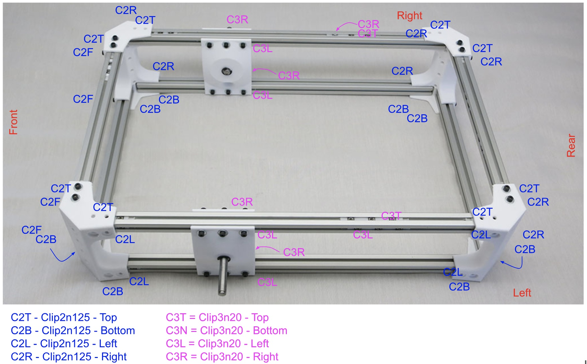
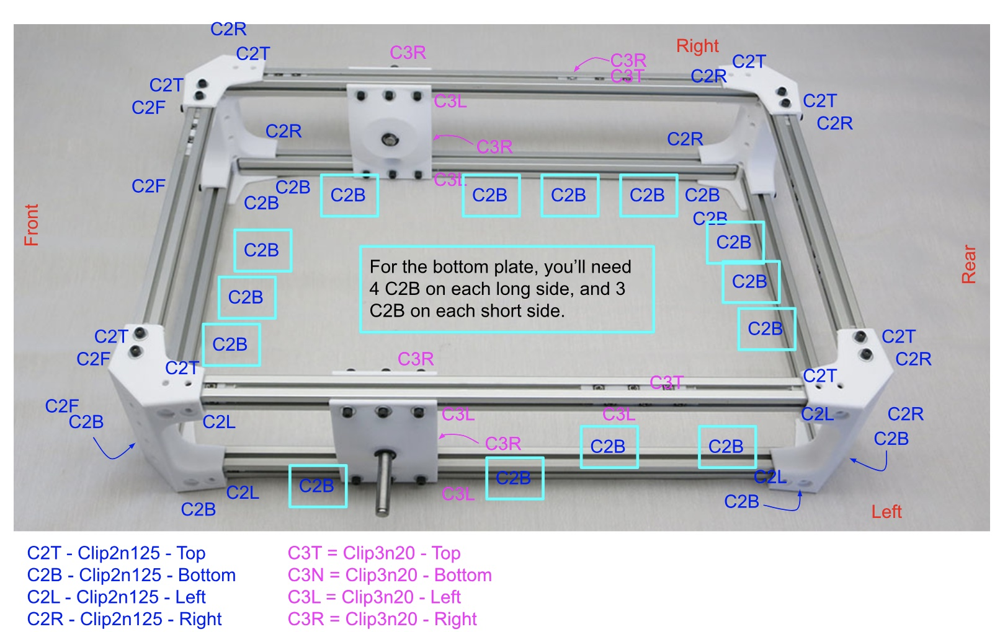
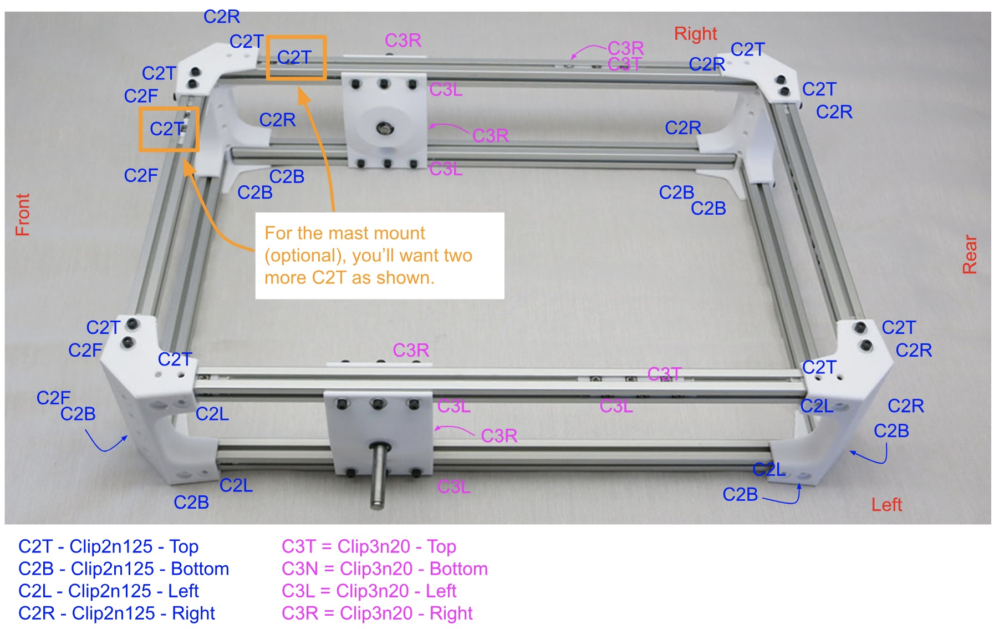
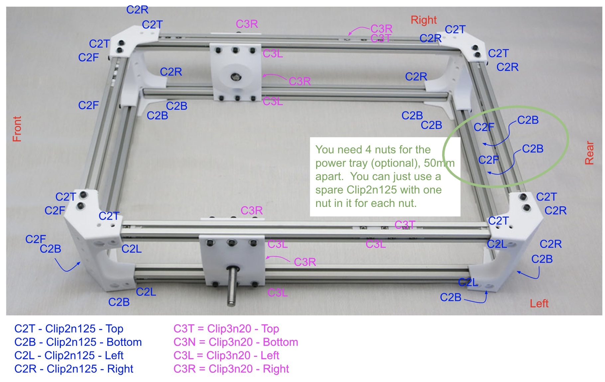

# Body Assembly

These parts make up the box that serves as the rover's main body and equipment bay.

**Estimated Time:** 1 hour 15 minutes

**Parts:**
* 4 * [Printed corner pieces](Print%20Body%20Box%20Corners.md)
* 4 * [385mm extrusion beams](Misumi%20HFS%203.md)
* 4 * [245mm extrusion beams](Misumi%20HFS%203.md)
* 2 * [Rocker joint body mount](AssemblePivotJoints.md)
* 12 * [Installation tool for 3 M3 nuts, 20mm apart](Print%20M3%20Installation%20Tool.md)
* 32 * [Installation tool for 2 M3 nuts, 12.5mm apart](Print%20M3%20Installation%20Tool.md)
* 100 * M3x8mm bolts
* 100 * M3 washers

***If using mast mount***
* 2 * [Installation tool for 2 M3 nuts, 12.5mm apart](Print%20M3%20Installation%20Tool.md)
* 4 * M3 washers

***If using power tray***
* 4 * [Installation tool for 2 M3 nuts, 12.5mm apart](Print%20M3%20Installation%20Tool.md)
* 4 * M3 washers

***If using bottom plate***
* 14 * [Installation tool for 2 M3 nuts, 12.5mm apart](Print%20M3%20Installation%20Tool.md)
* 28 * M3 washers

**Note:** Before attaching the rear body portion to the body sides, the last 4 of the [Installation tools for 3 M3 nuts, 20mm apart](Print%20M3%20Installation%20Tool.md) should be installed in the top beam of the right and left body sides for future installation of the [Differential End Pieces](../STL/DiffEnd.stl) during the [Suspension Differential Assembly](AssembleDifferential.md). They are installed in the top and outside slots of the top beams.

See figure below for all required nut locations.

Once you assemble the body, you don't have easy access to slide more nuts into the slots, so you need to decide now if you will want the option to add some accessories to the rover.

**Bottom Plate:** If you will be installing the bottom plate, you will need 14 more of [Installation tool for 2 M3 nuts, 12.5mm apart](Print%20M3%20Installation%20Tool.md), installed on the bottom slots, with 3 on the short ends and 4 on the long ends.

**Mast:** If you will be installing the mast, you will need 2 more of [Installation tool for 2 M3 nuts, 12.5mm apart](Print%20M3%20Installation%20Tool.md), installed on the top front right corner.

**Power Tray:** If you will be installing the power tray, you will need 4 more of [Installation tool for 2 M3 nuts, 12.5mm apart](Print%20M3%20Installation%20Tool.md), with two installed on the front of the rear top short beam, and two installed on the rear of the rear bottom short beam.

For proportion faithful to Curiosity rover side view seen in Onshape CAD file, there should be 62mm of aluminum extrusion visible between front face of "Rocker Body mount" and rear face of front "Body Corner".

In practice this can be moved forward/back as the builder pleases to maintain best balance for their rover chassis. Which will vary with every rover build as it depends on what's installed in equipment bay.

