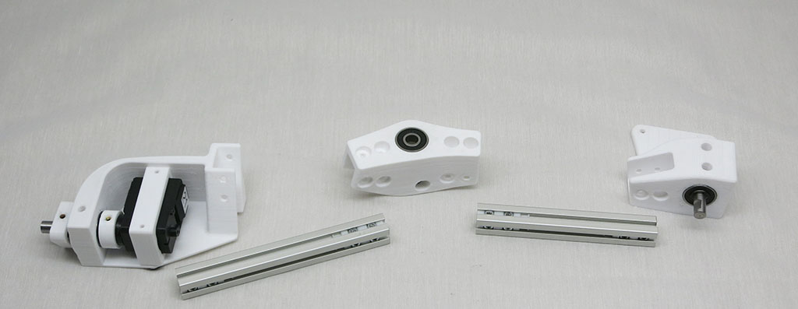
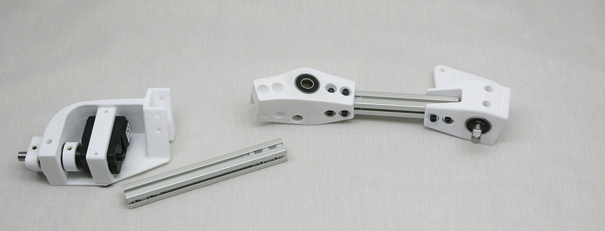
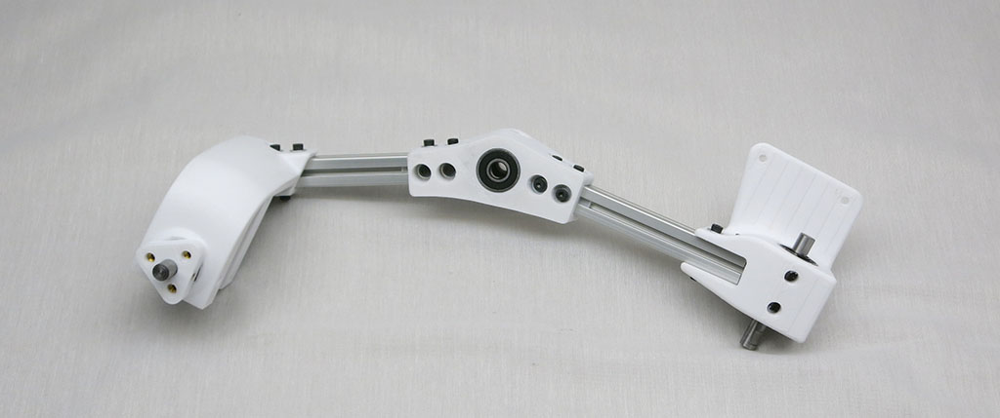
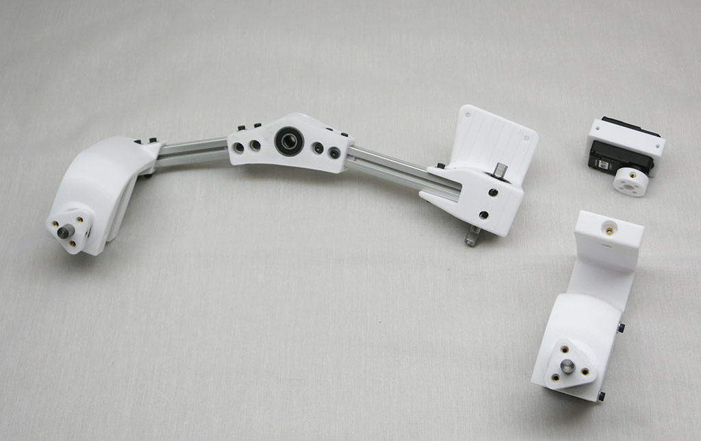
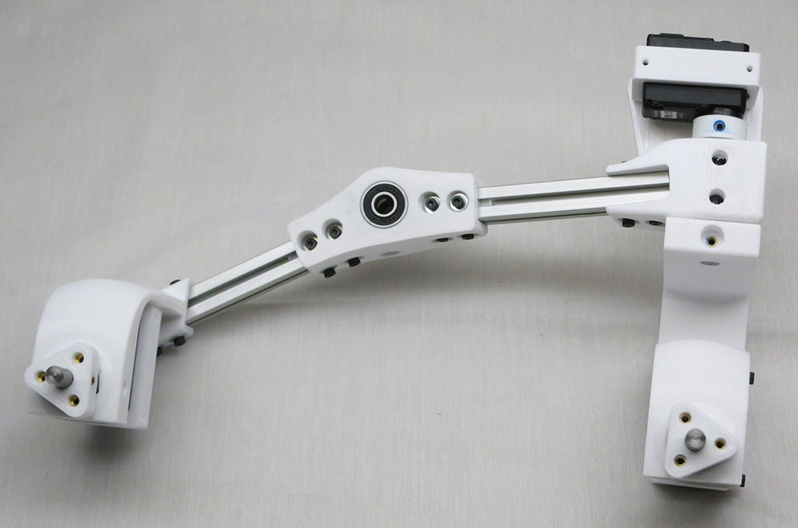
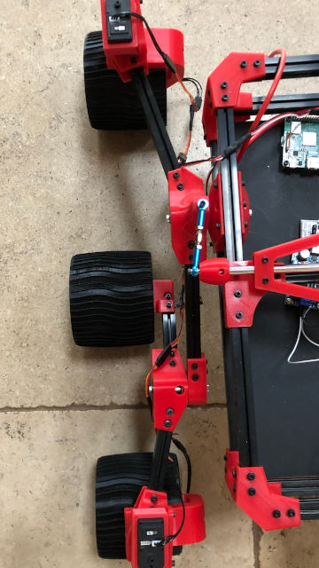
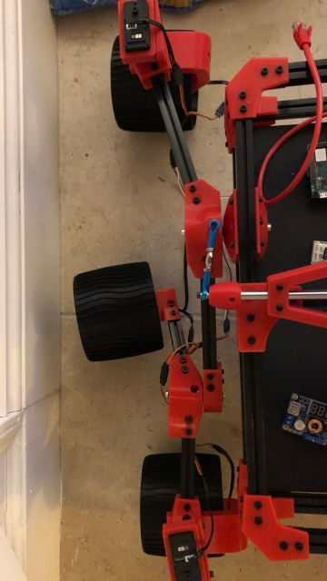

# Bogie Assembly

Bogie portion of the suspension links the middle wheel to the rear wheel.

**Estimated Time:** 30 minutes per side = 1 hour total

**Parts:**
* 1 * [117mm aluminum beam](Misumi%20HFS%203.md)
* 1 * [122mm aluminum beam](Misumi%20HFS%203.md)
* 1 * [Rear steering corner](Print%20Corner%20Steering%20Joints.md#rear-corners)
* 1 * [Fixed knuckle](Print%20Fixed%20Knuckle.md)
* 1 * [Bogie pivot](Print%20Suspension%20Bogie%20Joints.md#bogie-pivot)
* 1 * [Steering knuckle](Print%20Steering%20Knuckle.md)
* 1 * [Servo actuator module](AssembleActuatorModule.md)
* 11 * [M3 nut installation tool for 2 nuts, 12.5mm apart](Print%20M3%20Installation%20Tool.md)
* 2 * M3 set screws
* 24 * M3x8mm bolts
* 24 * M3 washers

The 117mm extrusion connects the Rear Corner and the angled side of the Bogie Wheel part.

The 122mm extrusion connects the Bogie Wheel part on the straight side, and the Fixed Knuckle. The extrusion extends from the open side of the Fixed knuckle.

The Rear Corner should extend out away from the body when the assembly is mounted.

Repeat for other side of rover.

## Sawppy V1 Errata
Sawppy v1 has a design flaw where it is easy to make the mistake of using the
left side Bogie-Wheel part on the right side of the rover. (And vice-versa.) Several
rover builders ran into this, and I am contemplating several ways to improve. In the
meantime please be aware: If a Sawppy rover's middle wheels are splayed out at
an angle rather than forward-back as designed, it is because the Bogie-Wheel parts
had been installed left-right reversed from intended. (Thanks to
[Tim](https://hackaday.io/timing2211) for sharing these pictures.)

Correct | Bogie-Wheel part reversed left-right
--- | ---
 | 
