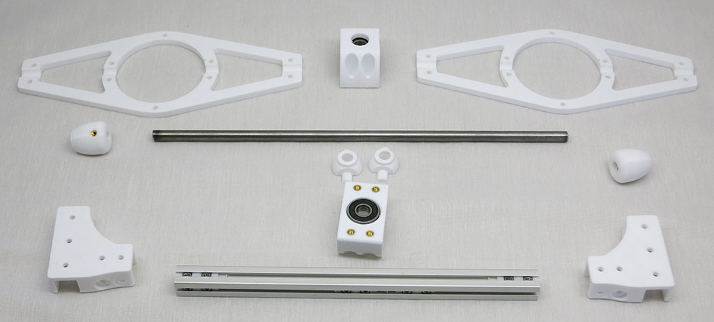
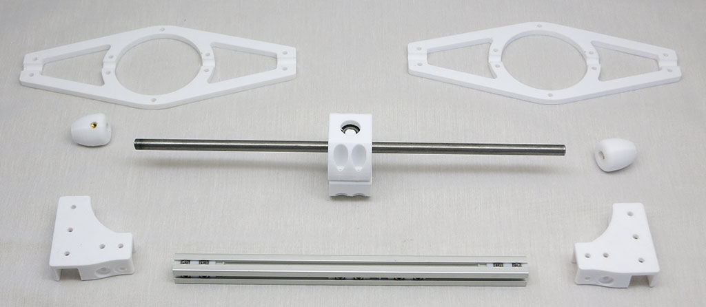
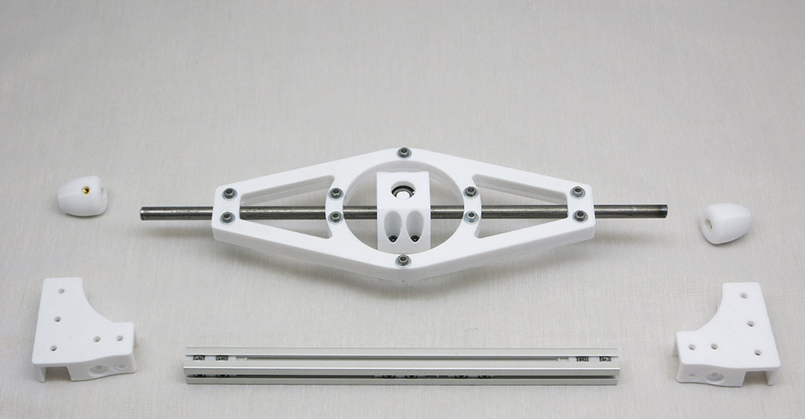
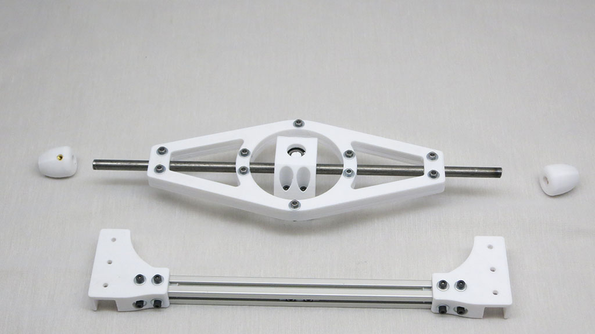
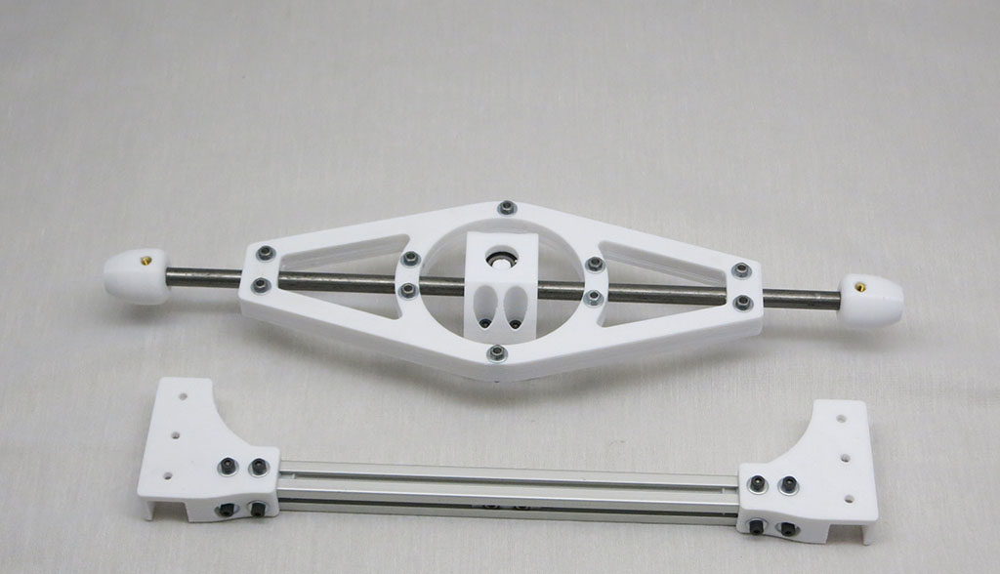
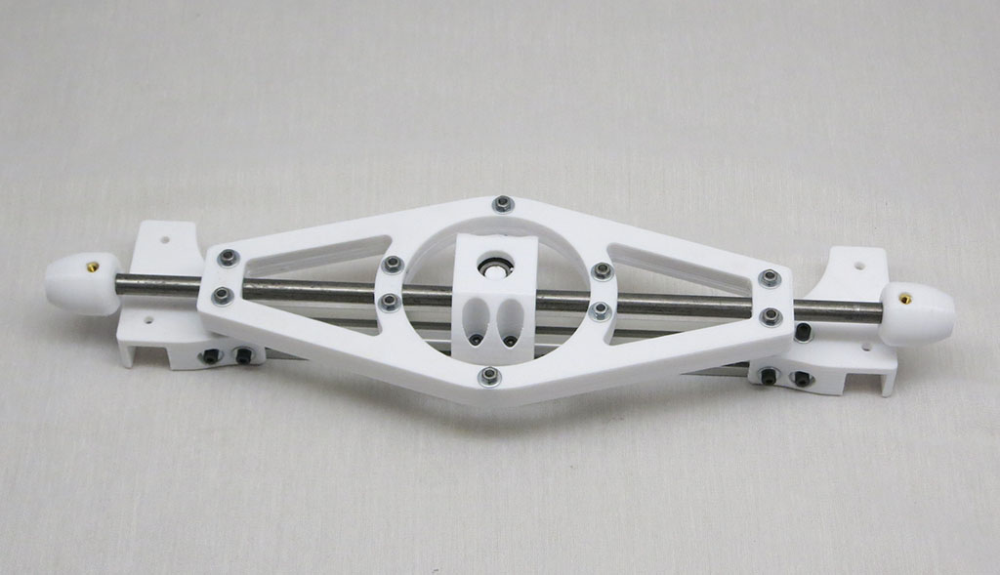
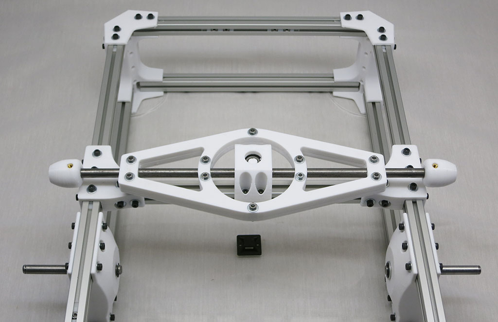

# Differential Assembly

The differential pivots about the center of the rover body to distribute suspension motion across
to the other side of the rover.

**Estimated Time:** 45 minutes

**Parts:**
* All [printed differential components](Print%20Differential.md)
* 1 * 8mm diameter 300mm long steel shaft
* 1 * [238mm aluminum beam](Misumi%20HFS%203.md)
* 8 * [M3 nut installation tool for 2 nuts, 12.5mm apart](Print%20M3%20Installation%20Tool.md)
* 32 * M3x8mm bolts
* 10 * M3x16mm bolts
* 26 * M3 nuts
* 52 * M3 washers
* 2 * M3 set screws

Use 4 M3x8mm bolts with washers to fasten upper and lower parts of differential pivot.

Use 10 M3x16mm bolts and nuts (with washers) to fasten top and bottom parts of differential brace together.

6 M3 nut installation tools, 12 M3x8mm bolts with washers.

2 M3 set screws to hold the links in place on the pivot shaft.

Bolt the differential onto the beam with 2 more M3 nut installation tools, 4 M3x8mm bolts with washers.

Bolt differential onto body box with 12 M3x8mm bolts with washers.

