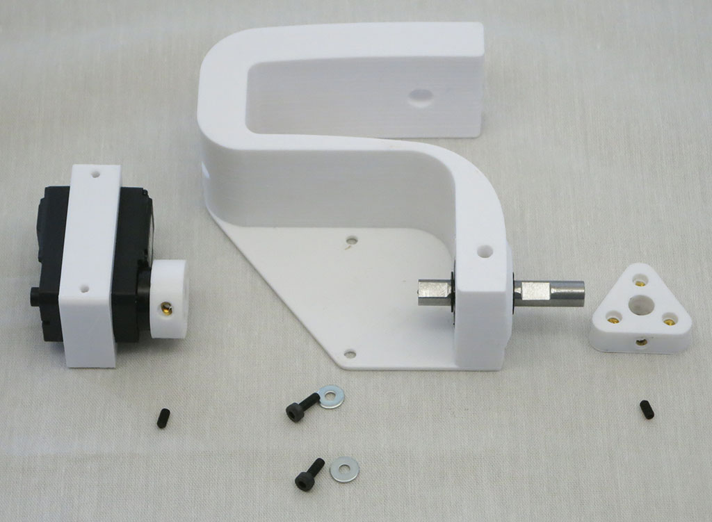
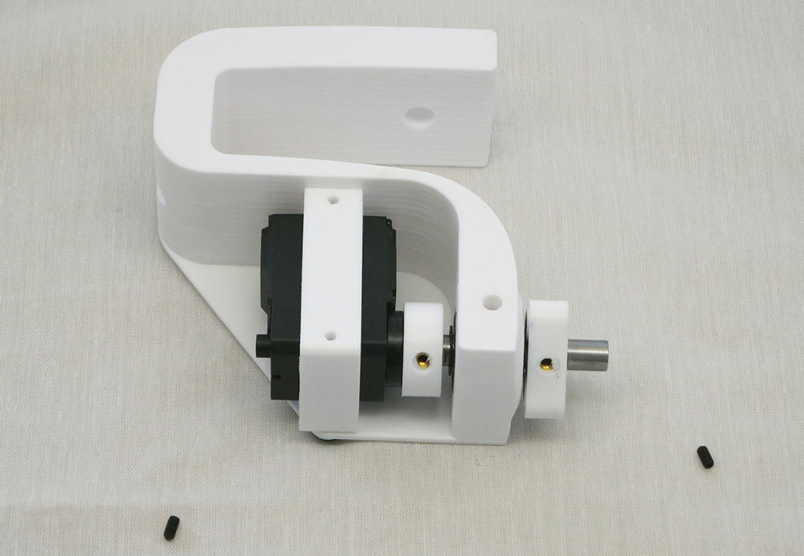
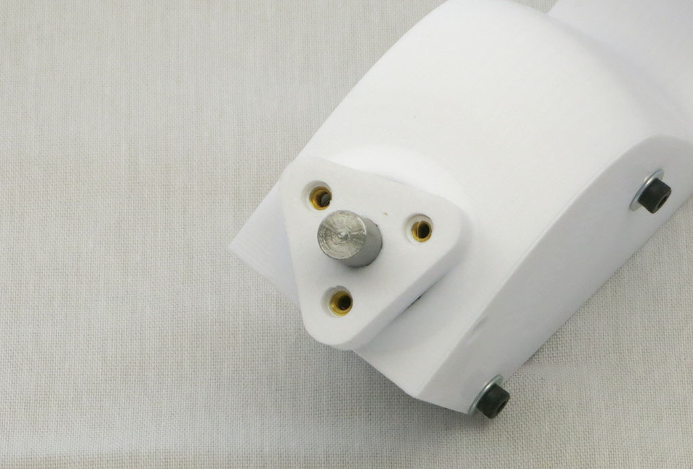
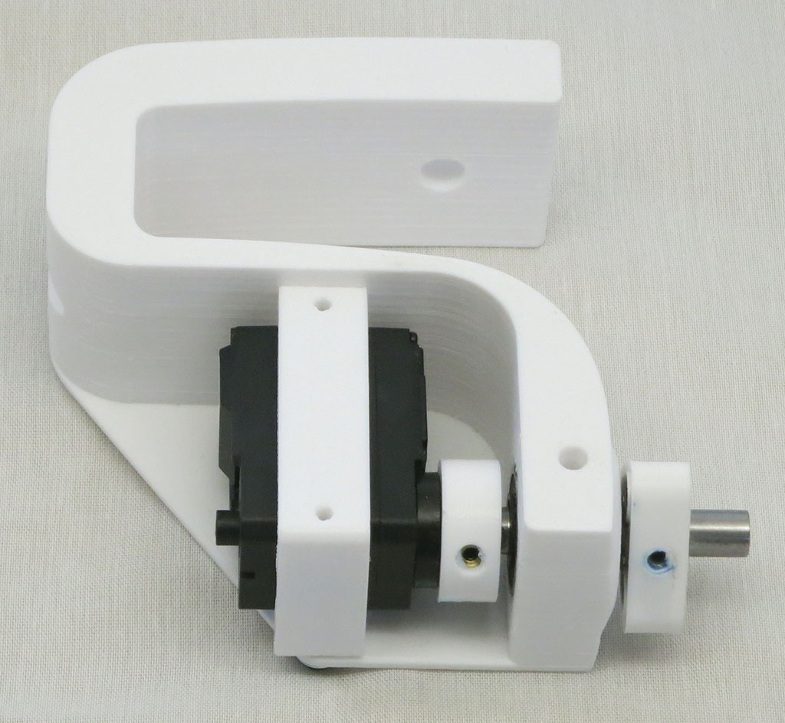
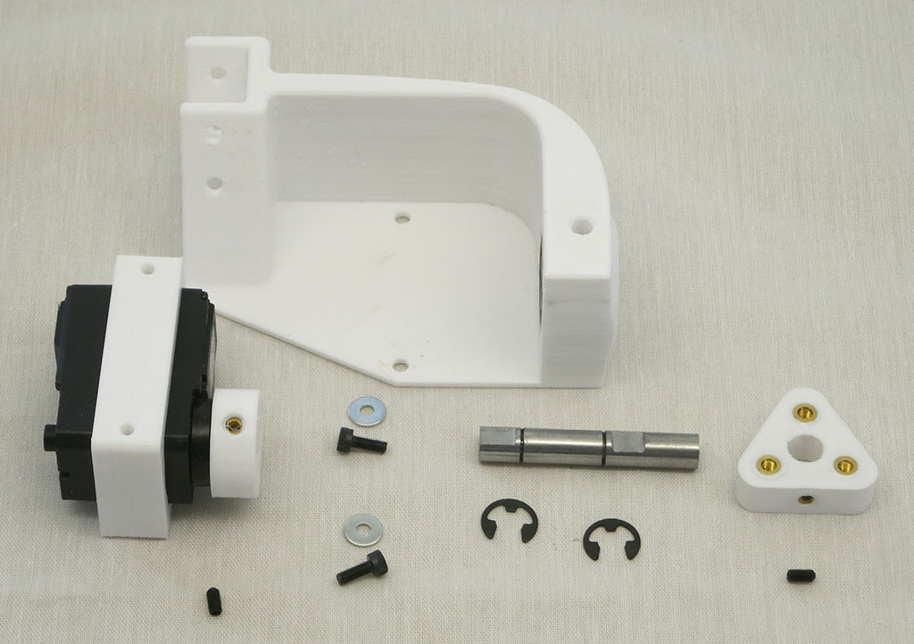

# Drive Module Assembly

This step builds drive modules for all six wheels. Four of these modules are for steerable corners
and the remaining two are the non-steering middle wheels.

**Estimated Time**: 6 minutes each * 6 units = 36 minutes total.

## Steerable Drive Module

**Parts:**
* 1 * [Servo actuator module](AssembleActuatorModule.md)
* 1 * [Steering knuckle](Print%20Steering%20Knuckle.md)
* 1 * [8mm wheel axle/drive shaft](Shaft8mm.md)
* 1 * [Wheel hub](Print%20Wheel%20Hub.md)
* 2 * Retaining E-clips
* 2 * M3 set screws
* 2 * M3x8mm bolts
* 2 * M3 washers

Use the two E-clips to install 8mm drive shaft into steering knuckle.

Use the two M3x8mm bolts, along with their washers, to install the servo actuator module.
Slide wheel hub onto drive shaft.

The M3 thread heat-set insert in the hub should be facing inward, away from the wheel.
(And this camera's viewpoint.)
This way when the wheel mounting bolts are tightened, the force will pull the heat set
insert tighter into the hub. If hub is installed reversed, wheel bolt force will be trying
to pull the heat set insert out of the hub which is undesirable.

Install set screws into servo coupler and wheel hub to attach them to the drive shaft.
Use thread-locking compound (Loctite Blue 242 shown) to keep the set screws in place.

Repeat for a total of four steerable drive modules.

## Non-Steerable Drive Module

Similar to above, except all the same parts are bolted onto the [non-steering fixed knuckle](Print%20Fixed%20Knuckle.md).

Repeat and assemble mirror-image module for the other side of the rover.
