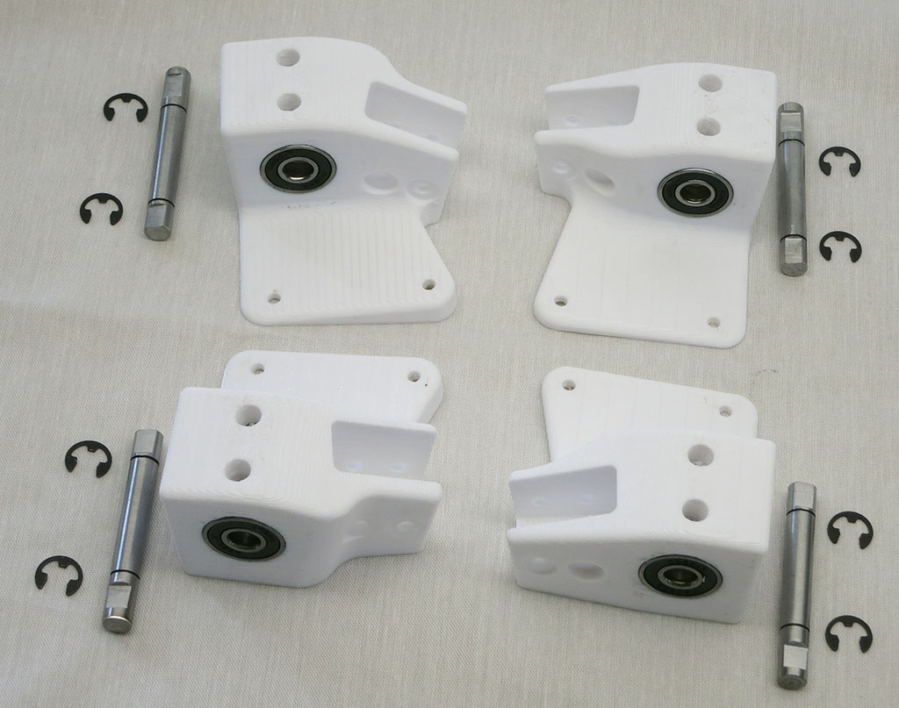
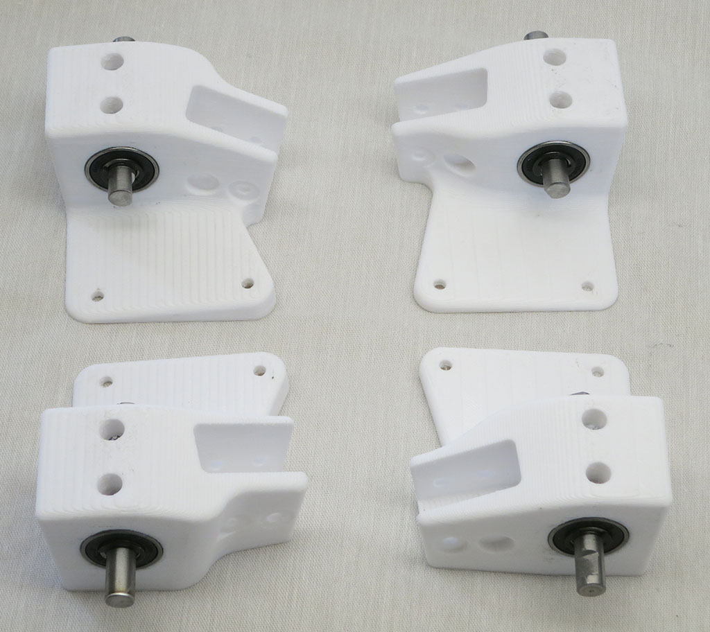
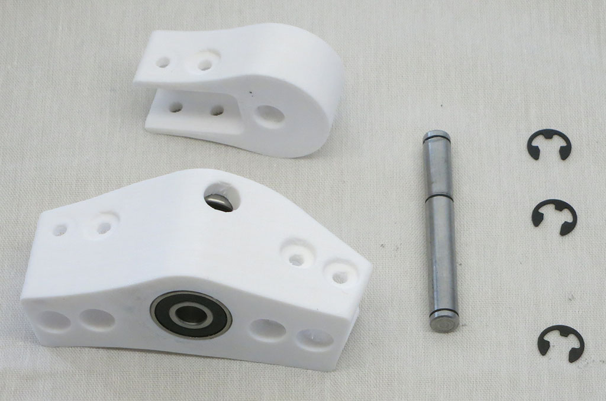
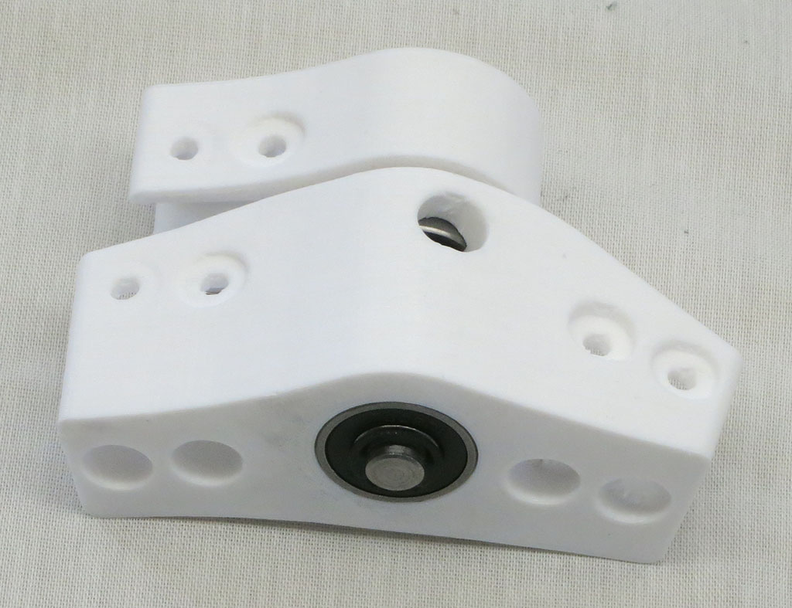
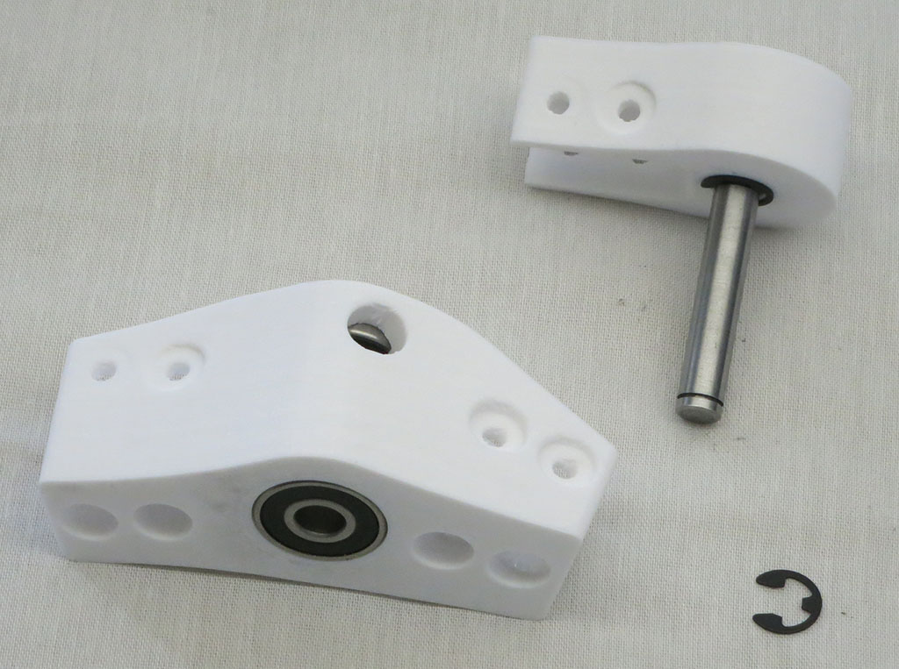
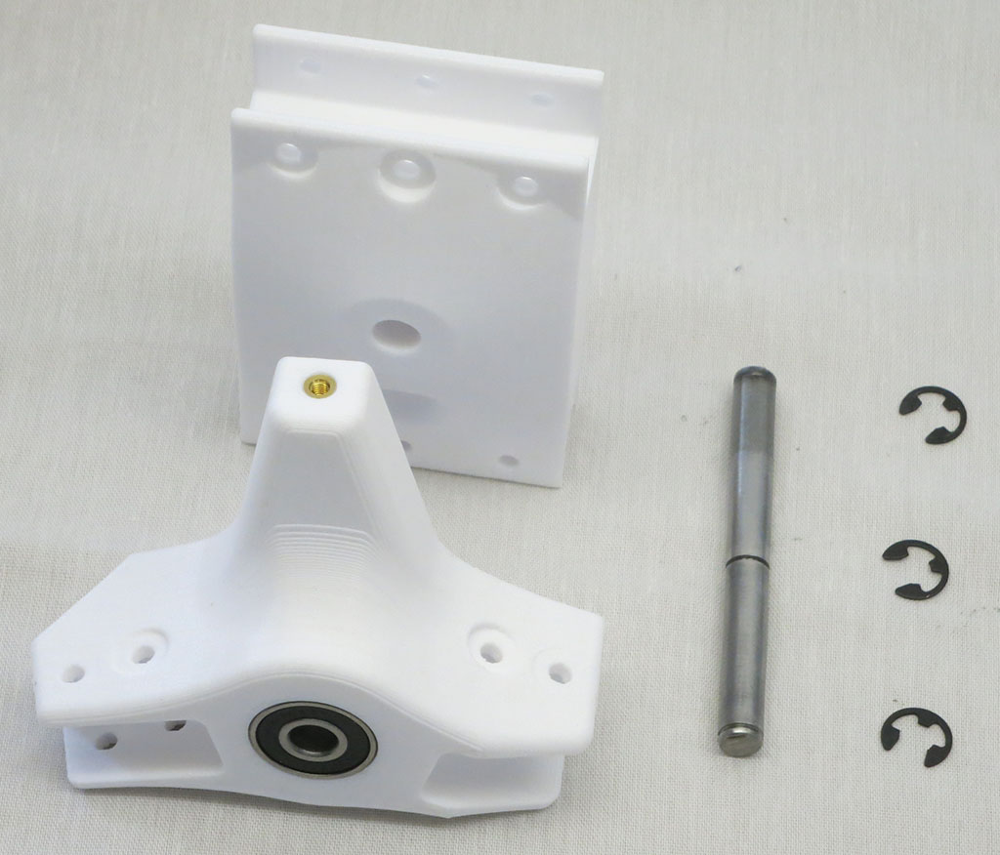
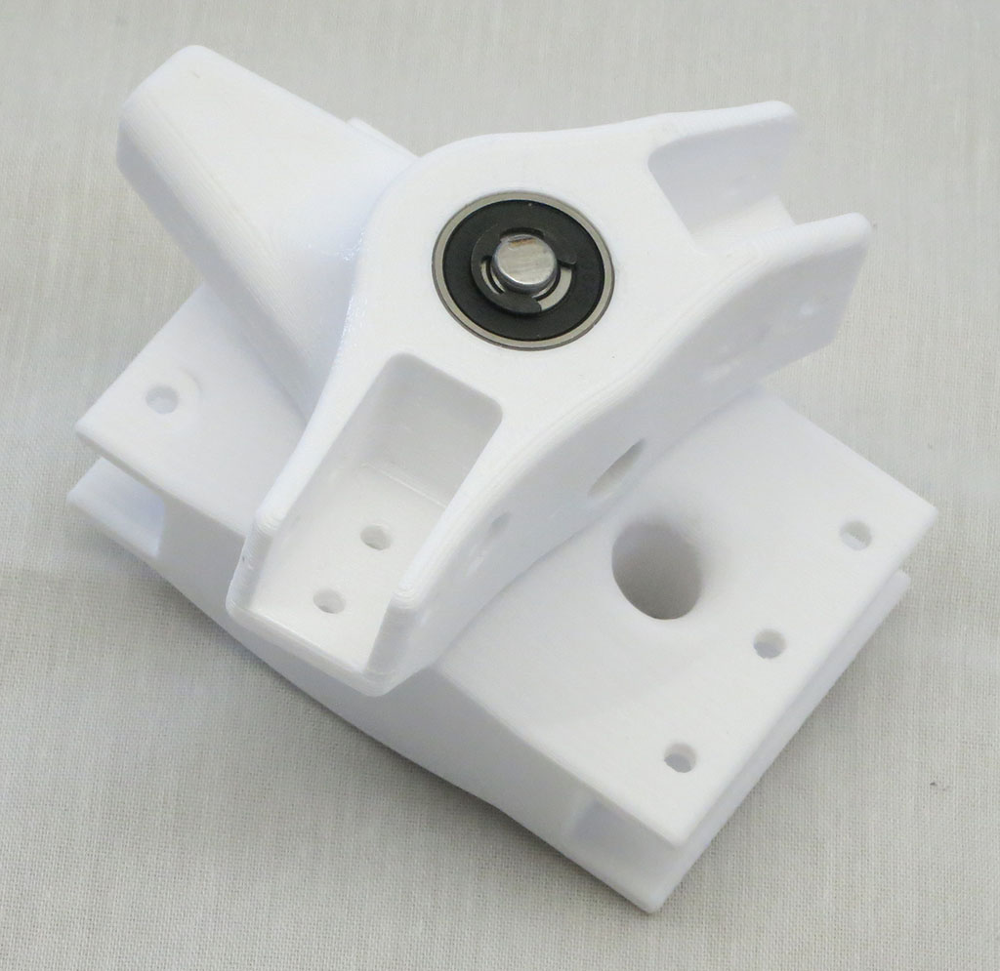
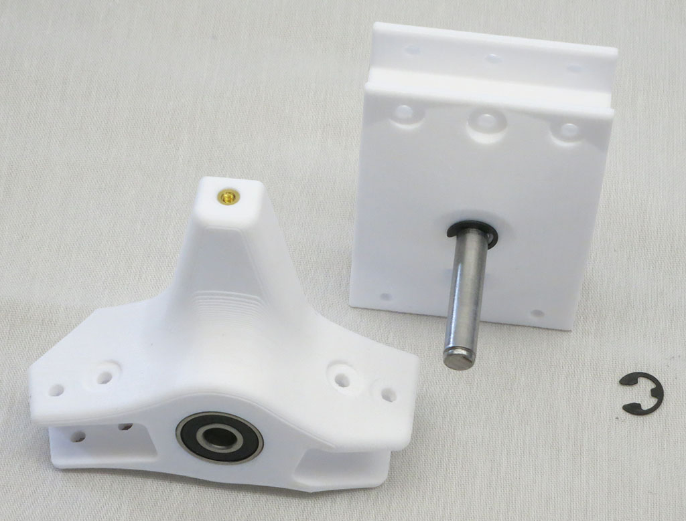

# Pivot Joints Assembly

This page covers assembly of all the steering/pivoting elements of rover suspension.

**Estimated Time:** 10 minutes total.

## Corner Steering

**Parts:**
* 4 * [Corner steering components](Print%20Corner%20Steering%20Joints.md)
* 4 * [Steering shafts](Shaft8mm.md)
* 8 * Retaining E-clips

For each corner steering module, use 2 e-clips to hold a steering shaft in place.

## Bogie Joint

**Parts:**
* 2 * [Bogie Joint](Print%20Suspension%20Bogie%20Joints.md)
* 2 * [Bogie Pivot Shaft](Shaft8mm.md)
* 6 * Retaining E-clips

Use 3 e-clips to install shaft into the joint, and both elements of the joint onto the shaft.

After all parts have been verified to fit, separate them again. They will be built into
different sub-assemblies before meeting back up again later.

Repeat for mirror-image bogie joint for other side of rover.

## Rocker Joint

**Parts:**
* 2 * [Rocker Joint](Print%20Suspension%20Rocker%20Joints.md)
* 2 * [Rocker Pivot Shaft](Shaft8mm.md)
* 6 * Retaining E-clips

Use 3 e-clips to install shaft into the joint, and both elements of the joint onto the shaft.

After all parts have been verified to fit, separate them again. They will be built into
different sub-assemblies before meeting back up again later.

