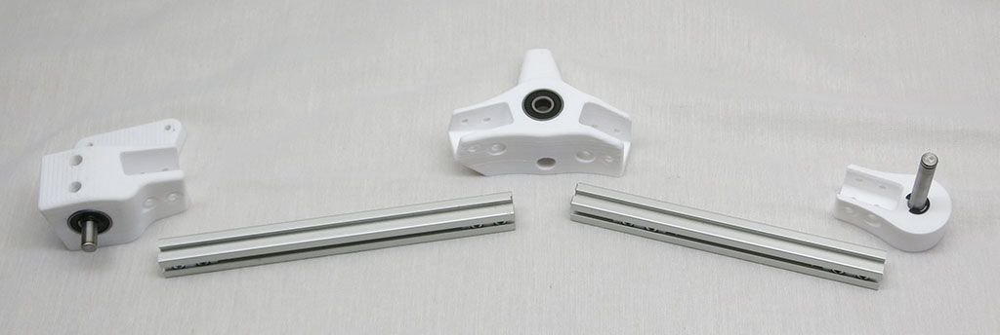
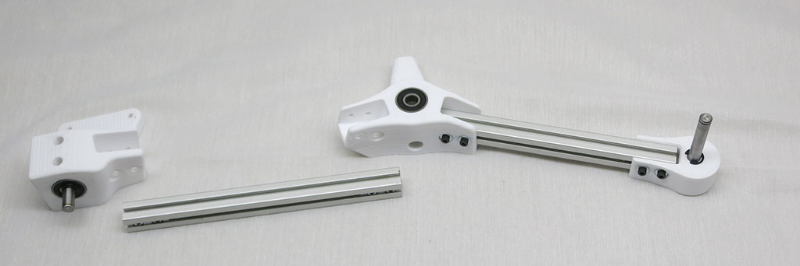
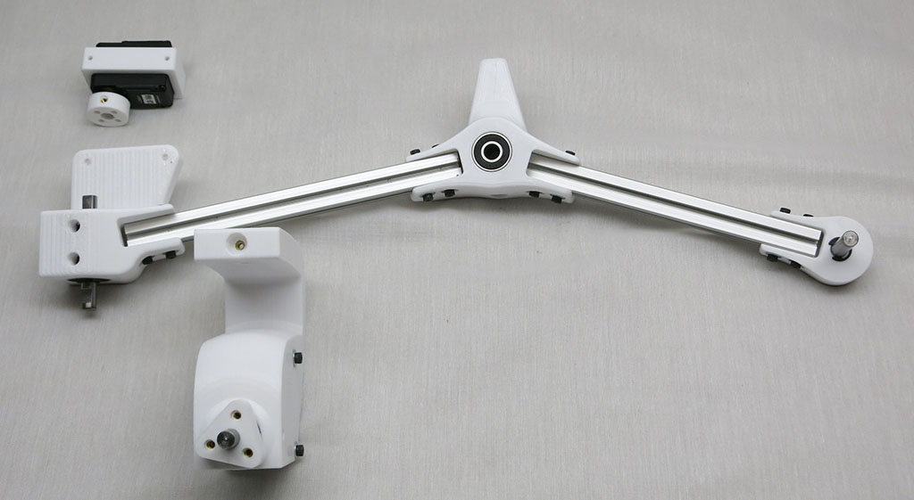
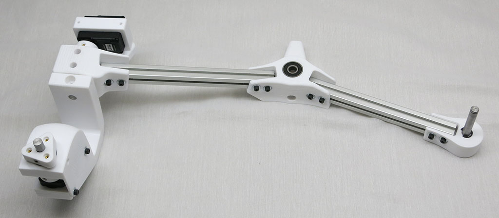
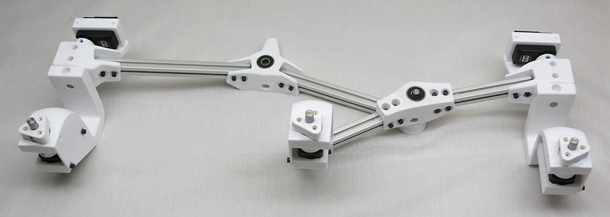
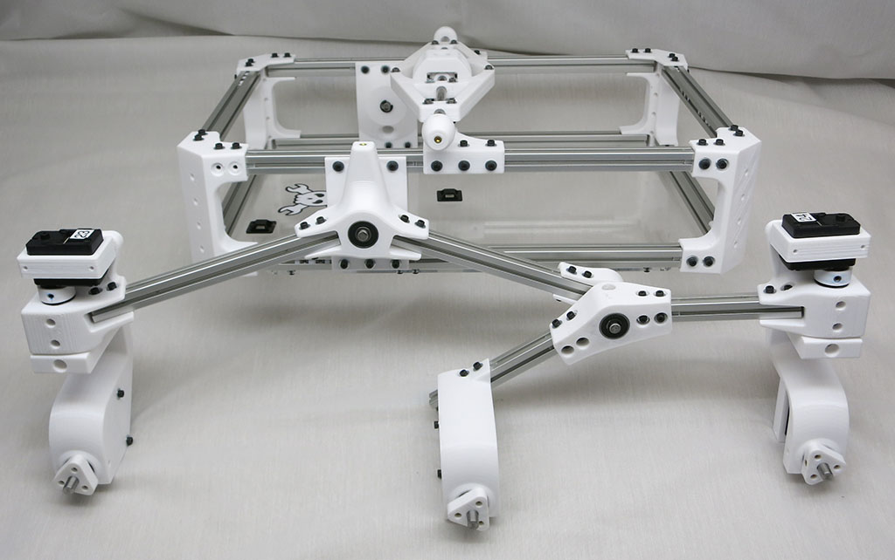
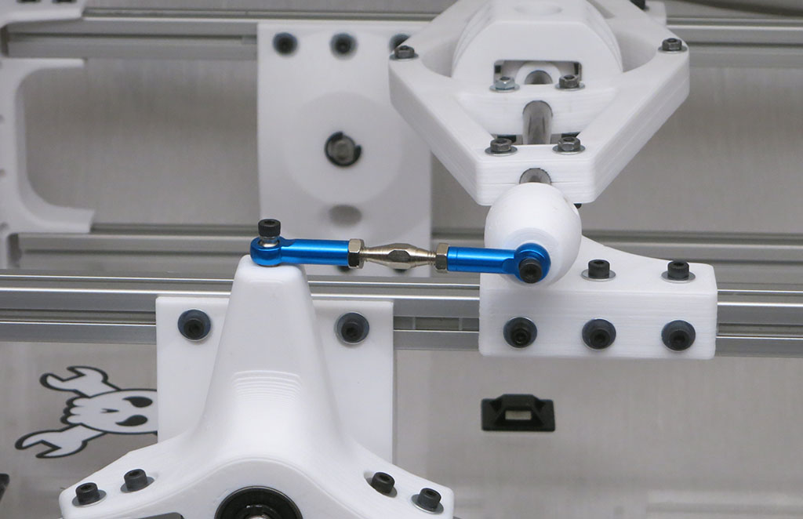

# Rocker Assembly

Rocker portion of suspension arm links the front wheel to the bogie assembly.
The whole suspension subassembly is then mounted to the main body box.

**Estimated Time:** 30 minutes each * 2 sides = 1 hour total

You will use the 161mm and 182mm extrusions for this.

You will also need the Bogie End, Front Corner, and the Rocker printed parts.

Aluminum beam to link to bogie. The 161mm extrusion goes between the Bogie End and the straight side of the Rocker.

Aluminum beam to link to front corner. The 182mm extrusion goes between the angled side of the Rocker and the Front Corner.

Front corner steering mechanisms.

Rocker subassembly complete.

Rocker subassembly plus bogie subassembly. The three wheel mounts should all be roughly in line with each other.

Rocker-bogie installed on body.

Rocker-bogie connects to differential via turnbuckle.

Repeat for other side of body.
