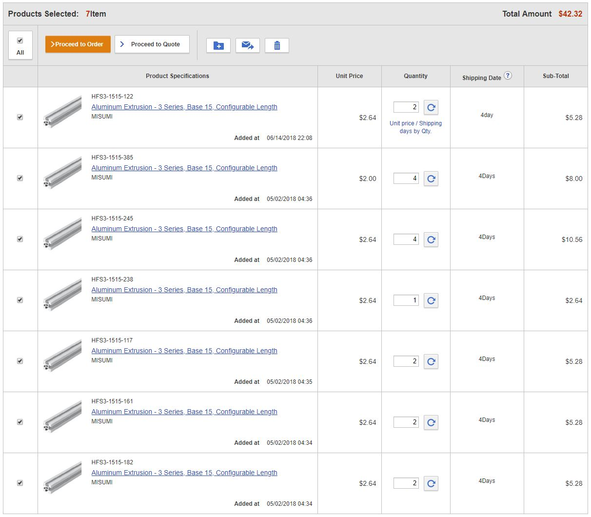

# Structural Beams

Sawppy the Rover's aluminum beam structures are from [Misumi's HFS 3-series.](https://us.misumi-ec.com/vona2/detail/110300465870/)
They are 15mm by 15mm square in profile and there are different options for purchase, more details below for aspiring
rover builders in the USA.

Unfortunately, Misumi subsidiaries outside United States (such as Misumi Europe) are not as hobbyist-friendly
selling only to businesses and not individuals. Fortunately, Sawppy design is not picky about the exact extrusion 
profile and any beams 15mm by 15mm square should work with little to no modifications. One such alternative is
[MakerBeamXL](https://www.makerbeam.com/makerbeamxl/) which has been successfully used to build Sawppy rovers by 
[Rhys in Wales](https://hackaday.io/rhys.mainwaring) and [HolgerDK in Denmark](https://hackaday.io/HolgerDK).
Another option is AliExpress, source of
[beams used to build Aussie Sawppy](https://hackaday.io/project/166017-aussie-sawppy/log/164843-aussie-sawppy-parts-procurement).

I've also heard from a rover builder using 15mm wooden beams, which gives the rover a smooth external profile.
There is also an Argentinian contingent investigating 15mm square profile metal tubes. I expect additional modifications
will be necessary for these efforts, but we won't know until these intrepid explorers report their results.

## Aluminum Extrusions Beams for Rover Chassis

The following quantities and lengths are required to build Sawppy:

Quantity | Length (mm) | Purpose
--- | ---: | ---
4 | 385 | Main body box, lengthwise
4 | 245 | Main body box, widthwise
1 | 238 | Main body differential fixed beam
2 | 182 | Suspension member connecting rocker joint to front wheel
2 | 161 | Suspension member connecting rocker joint to bogie joint
2 | 122 | Suspension member connecting bogie joint to mid wheel
2 | 117 | Suspension member connecting bogie joint to rear wheel

## Cost estimate

__Option 1: Cut the beams yourself__

Purchase standard 2-meter lengths of HFS3 from Misumi and cut to length yourself. This is the most economical option if you have
a saw that can cut aluminum. Or if you have more time than money and willing to hacksaw all the pieces by hand.
This is also the best option if you want to experiment with modifying the rover design.

Fortunately Sawppy is designed so precise length is not necessary, and the cut ends don't have to be perfectly square.
An extrusion can be up to 5mm shorter than specified, or have sloped cut ends, and the rover will still work. Such
imperfections can be compensated for with few extra millimeters of space when bolting plastic pieces onto beams.

The above lengths add up to 3922mm. If you are really good with planning and have a very thin saw blade, it is possible to
cut all rover parts out of two 2-meter pieces of extrusion. This has been confirmed by several other rover builders.

2 * $7.40 = $14.80

__Option 2: Order beams from Misumi cut to length__

Misumi offers a configurable length service where they will cut the beams to your specified lengths. This will result
in perfectly square cut ends and the lengths will be very accurate. Misumi guarantees +/- 0.5mm but internet forum
posts indicate in practice it's far more precise than that.

The convenience and precision will cost $42.32.

