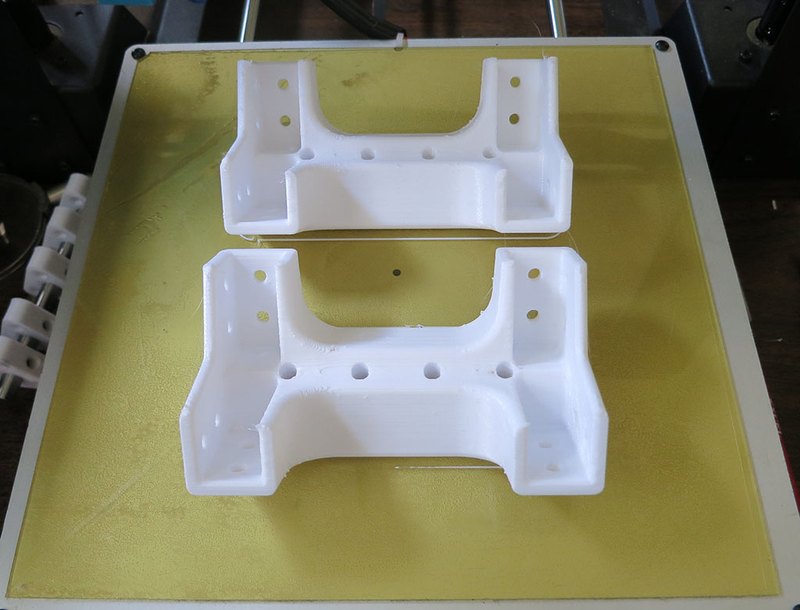

# Body Box Corners

These pieces make up the four corners of Sawppy's main equipment bay. They are connected to each other
via aluminum extrusion beams. Each corner has four holes for M3 thread heat-set inserts, as preparation
for future sensors installation.

**CAD source** [Body Corner](https://cad.onshape.com/documents/43678ef564a43281c83e1aef/w/392bbf8745395bc24367a35c/e/96f29082d5f6df96d18015bb)

**3D Printing STL File:** [Body Corner.stl](../STL/Body%20Corner.stl)

**3D Printing Notes**
* We will need 4 of these, one for each corner of rover equipment bay.
* Lay the shape on print bed as shown in picture below for best strengh from print layer orientation.
* Example print durations:
  * Fast PLA rough draft: 4 hours each * 4 units = 16 hours total.
  * Slow PETG final draft: 6.5 hours each * 4 units = 26 hours total.

**Post-Processing:**

No special processing required.
