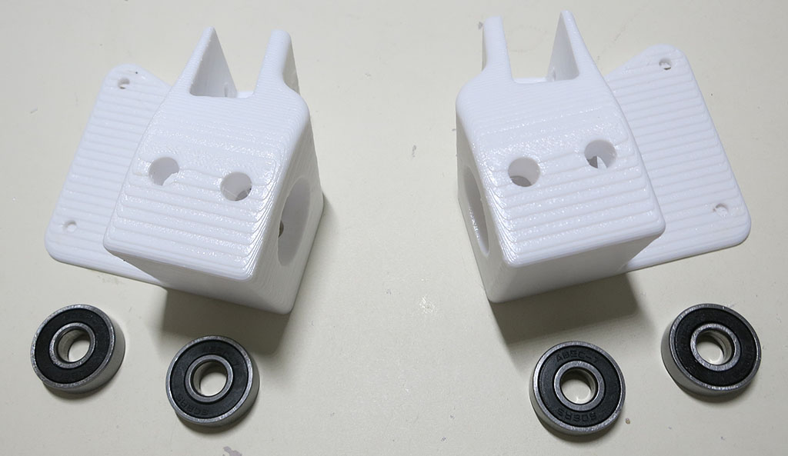
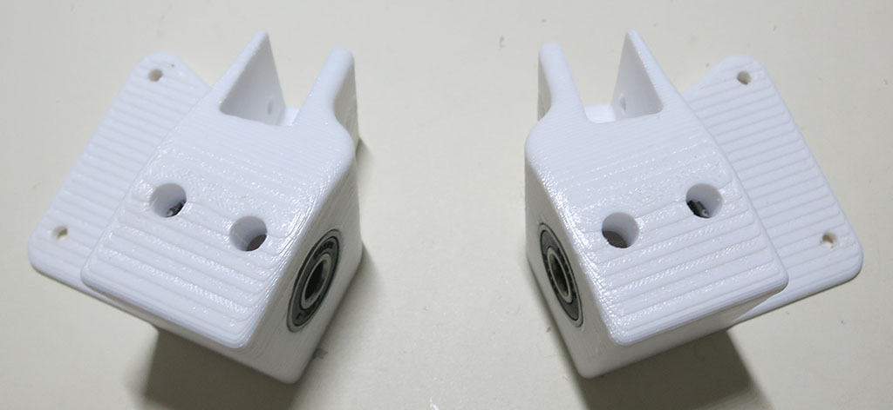

# Corner Steering Joints

These parts, one per corner, hold the steering actuators along with the steering shaft.
Plus auxiliary support mechanisms like the 608 bearings supporting the steering shaft.
Each of these sit on top of a steering knuckle and associated steerable wheel assembly.

### Front corners

**CAD source** [Front Corner](https://cad.onshape.com/documents/43678ef564a43281c83e1aef/w/392bbf8745395bc24367a35c/e/9ae94dbd0d5c2040aede037a)

**3D Printing STL File:** [Front Corner.stl](../STL/Front%20Corner.stl)

**3D Printing Notes**
* We will need 2 of these, mirror-image of each other. One for each front corner.
* Example print durations:
  * Fast PLA rough draft: 4.5 hours each * 2 corners = 9 hours total.
  * Slow PETG final draft: 5.2 hours each * 2 corners = 10.4 hours total.
  
**Post-Processing:**

Estimated time: 2 minutes per corner * 2 corner = 4 minutes total.

**Parts:**
* 2 * 3D printed front corner pieces, one mirror of the other.
* 4 * 608 type bearings

Use a drill to remove bridge assist layers on 4 bolt holes facing the print bed.

Install two bearings - one top and one bottom - onto each front corner piece.

### Rear corners

**CAD source** [Rear Corner](https://cad.onshape.com/documents/43678ef564a43281c83e1aef/w/392bbf8745395bc24367a35c/e/223fadf8466f52bf16bdc5f7)

**3D Printing STL File:** [Rear Corner.stl](../STL/Rear%20Corner.stl)

**3D Printing Notes**
* We will need 2 of these, mirror-image of each other. One for each rear corner.
* Example print durations:
  * Fast PLA rough draft: 4 hours each * 2 corners = 8 hours total.
  * Slow PETG final draft: 4.7 hours each * 2 corners = 9.4 hours total.

**Post-Processing:**

Estimated time: 2 minutes per corner * 2 corner = 4 minutes total.

**Parts:**
* 2 * 3D printed rear corner pieces, one mirror of the other.
* 4 * 608 type bearings

Use a drill to remove bridge assist layers on 4 bolt holes facing the print bed.

Install two bearings - one top and one bottom - onto each front corner piece.

