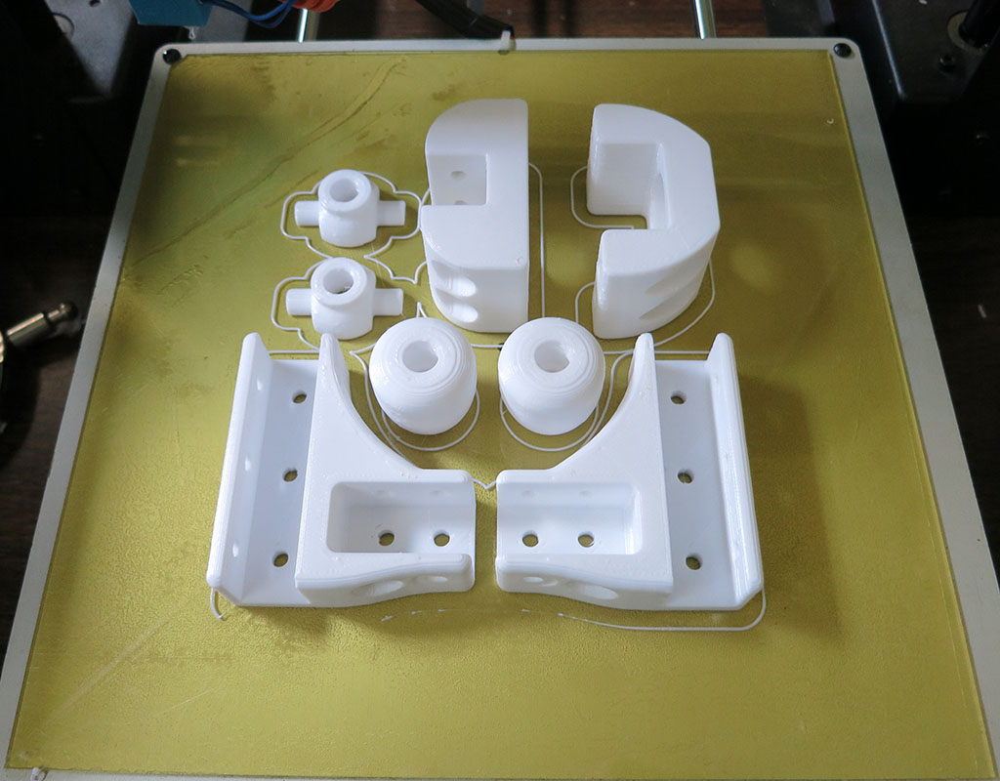
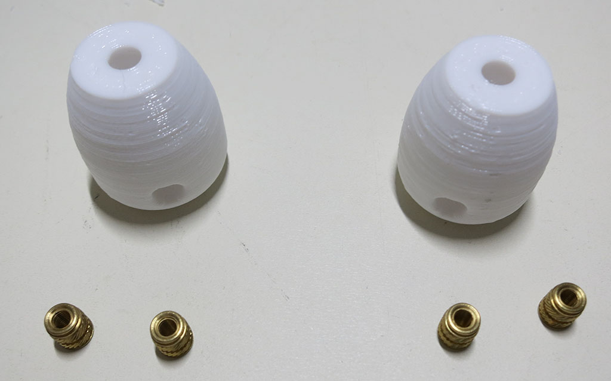
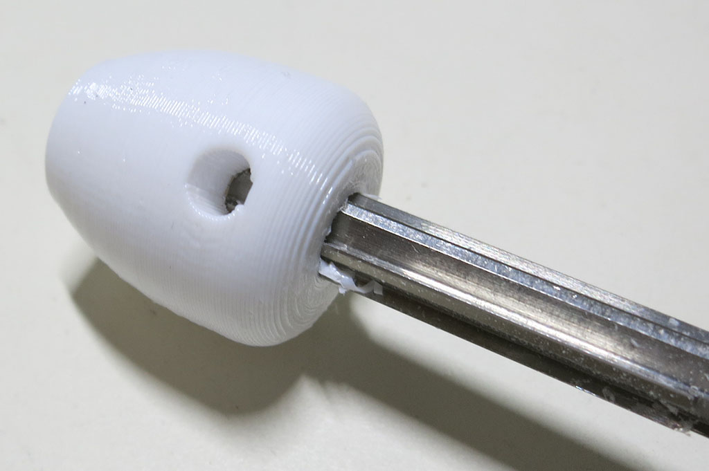
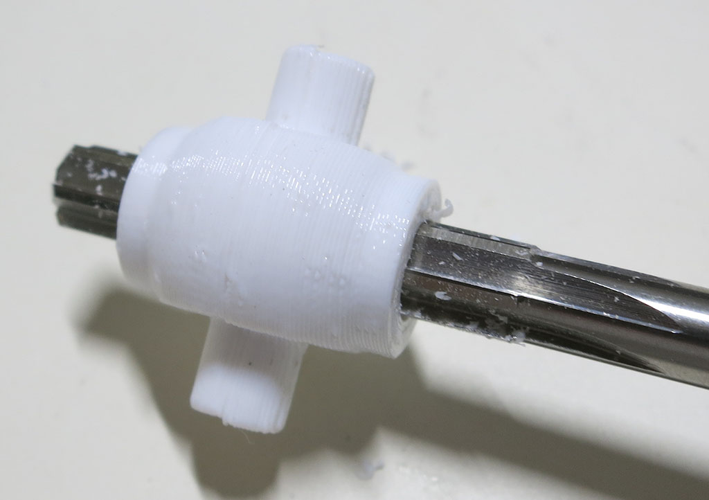
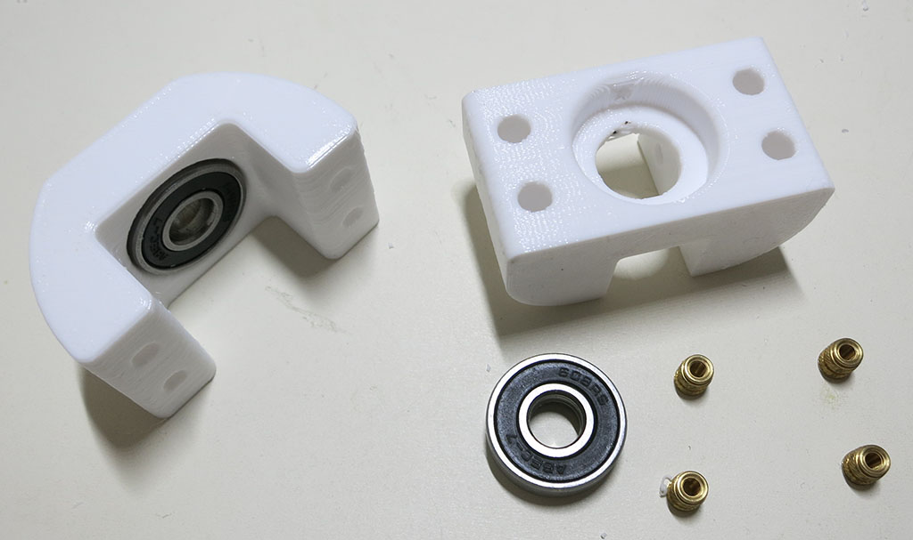

# Differential

The differential on Sawppy is different from the differential in an automotive drivetrain. Instead of
distributing different forces across different drive wheels, this differential distributes suspension
forces across the two sides. It is a key part of how the [rocker-bogie suspension](https://en.wikipedia.org/wiki/Rocker-bogie)
keeps all six wheels on the ground.

**CAD source** [Differential](https://cad.onshape.com/documents/43678ef564a43281c83e1aef/w/392bbf8745395bc24367a35c/e/ded3b96eec03ac1553f6b0a8)
with brackets to mount to body in [Body Box Mounts](https://cad.onshape.com/documents/43678ef564a43281c83e1aef/w/392bbf8745395bc24367a35c/e/4b42dffa042b70b94b3d0d85)

**3D Printing STL Files:**
* [DiffBrace.stl](../STL/DiffBrace.stl) * 2
* [DiffEnd.stl](../STL/DiffEnd.stl) * 2
* [DiffLink.stl](../STL/DiffLink.stl) * 2
* [DiffLower.stl](../STL/DiffLower.stl) * 1
* [DiffUpper.stl](../STL/DiffUpper.stl) * 1
* [Rod Support.stl](../STL/Rod%20Support.stl) * 2

**3D Printing Notes:**
* The [differential brace](../STL/DiffBrace.stl) is a large part that needs to be rotated 45 degrees
in order to fit on a 200mm x 200mm print bed.
* Aside from the differential brace, everything else can be printed together.

**Post-Processing:**

The most dimension-critical part is the differential link. It needs to grab onto the 8mm shaft used as differential
rod via set screws. It also needs M3 threads to connect (via a turnbuckle) to the suspension rocker arm.

Use 8mm reamer to ensure good fit on 8mm rod used for differential rod.

The pair of rod supports also need 8mm reamer cleanup.

The lower differential part needs four M3 thread heat set inserts. The upper and lower parts also each get a bearing.

