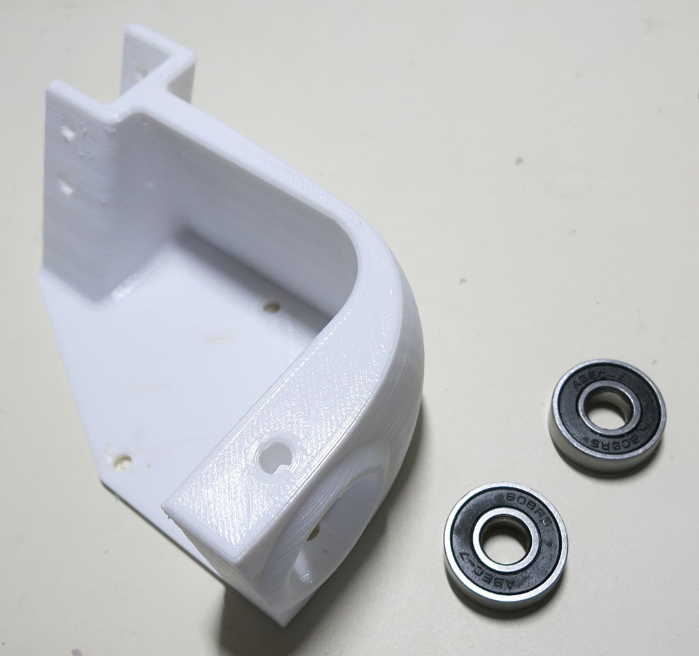
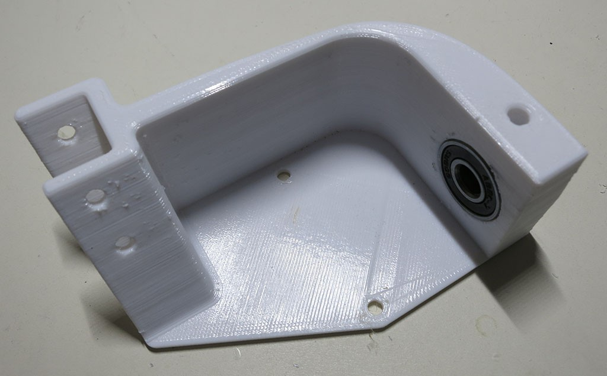

# Fixed Knuckle

The two fixed knuckles connect the middle non-steerable wheels to the aluminum extrusion beams making up the suspension structure.

**CAD source** [Wheel Parts](https://cad.onshape.com/documents/43678ef564a43281c83e1aef/w/392bbf8745395bc24367a35c/e/97ee620b9a27889d24f20c4d)

**3D Printing STL File:** [Fixed Knuckle.stl](../STL/Fixed%20Knuckle.stl)

**3D Printing Notes:**
* We will need two of these objects, one for each side of rover suspension. One must be printed mirror-image of the other.
* Example print durations:
  * Fast PLA rough draft: 3.5 hours each * 2 knuckles = 7 hours total.
  * Slow PETG final draft: 5.5 hours each * 2 knuckles = 11 hours total.

**Post-Processing**

Estimated time: 2.5 minutes per knuckle * 2 knuckles = 5 minutes total.

**Tools:**
* (Optional) C-clamp or arbor press

**Parts:**
* 3D printed fixed knuckle
* 2 * Type 608 bearings

Bearings are installed in the same way they were installed for the [steering knuckle](./Steering%Knuckle.md).

