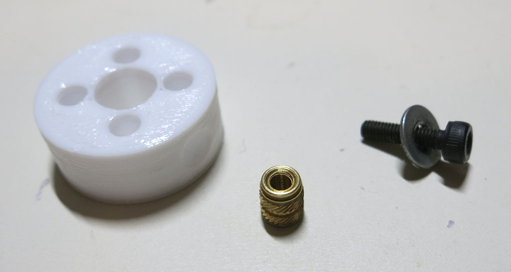
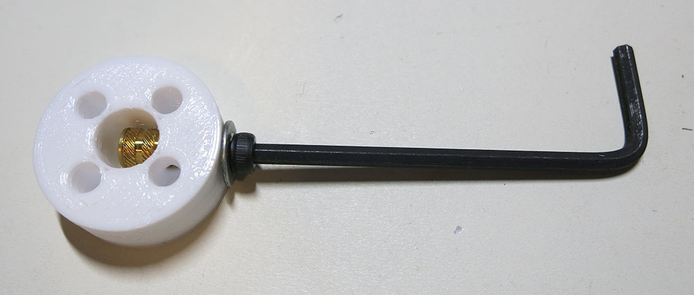
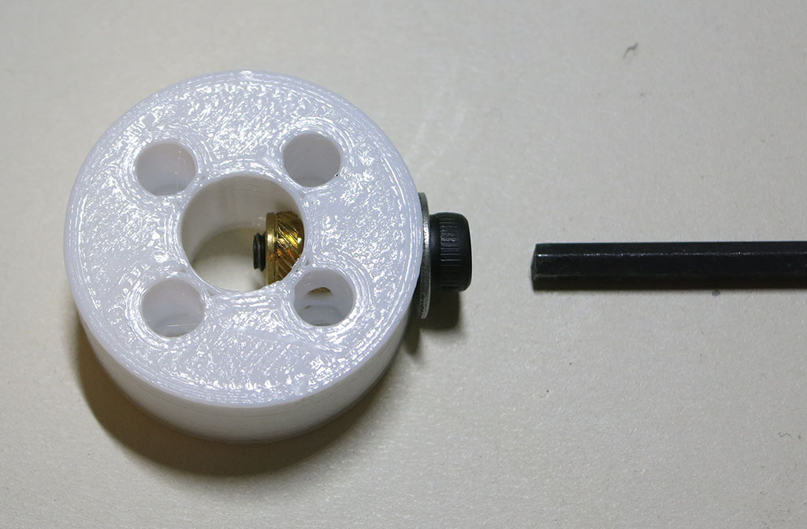
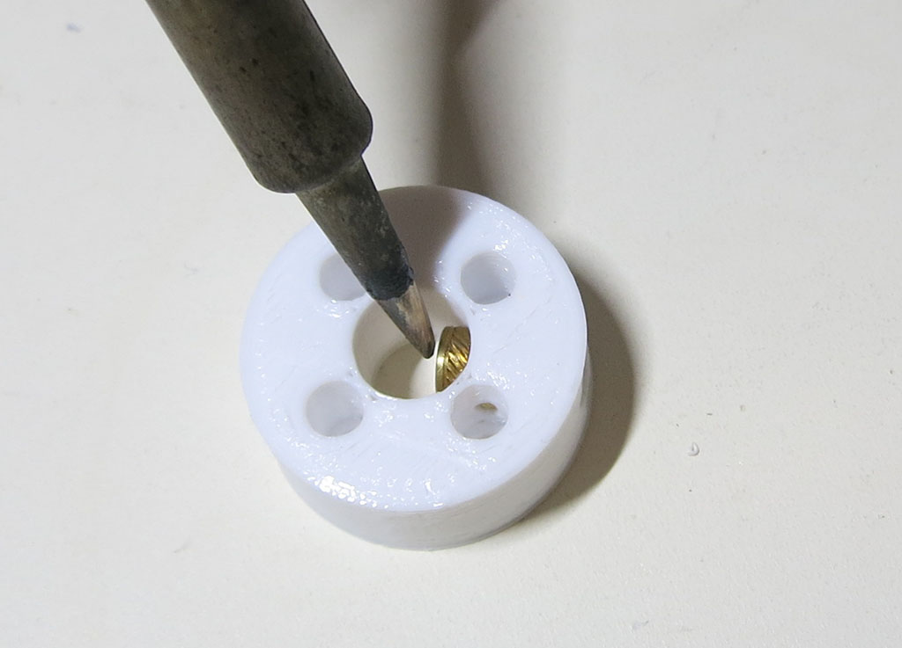
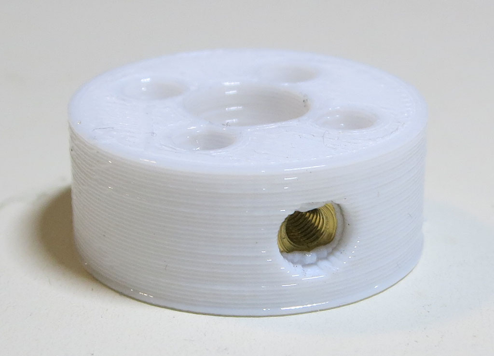
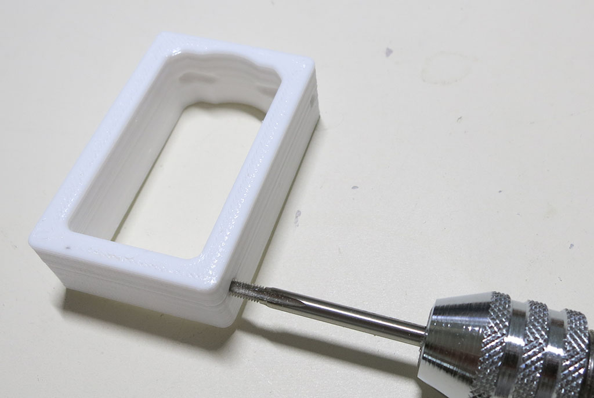

# LewanSoul LX-16A shaft coupler and mounting bracket

Information here builds Sawppy with [LewanSoul LX-16A](http://www.lewansoul.com/product/detail-146.html) servos. 

**CAD source** [LX-16A](https://cad.onshape.com/documents/43678ef564a43281c83e1aef/w/392bbf8745395bc24367a35c/e/214191f692ee748deef95a8d)

### To use other serial bus servos.

Sawppy's design can be adapted to other similar serial bus servos, for example the [Dynamixel AX-12A](http://www.robotis.us/ax-12a/)
or the [Herkulex DRS-0101](http://www.dongburobot.com/jsp/cms/view.jsp?code=100788).

The conversion process involves making a shaft coupler and a bracket that fits the specific servo and mounts
to the same places (Two M3 screws + 8mm shaft) as the LewanSoul LX-16A actuator module pictured here.
Mechanically, the remainder of the rover would be the same.

## Coupler

The servo coupler connects the serial bus servo's output to the 8mm steel shaft for both steering a wheel or driving a wheel.

**3D Printing STL File:** [LX-16A - Coupler.stl](../STL/LX-16A%20-%20Coupler.stl)

**3D Printing Notes:**
* This coupler will be held on to the shaft via a set screw that will sit inside a bronze heat-set insert. (Installation instructions below.) The hole that hosts the insert needs to be the right diameter to work - too large, and the set screw will push it out. Too small, and the extra plastic will get in the way of the insert. If you're having trouble printing the holes properly, try stepping down to a finer-pitched print layer height.
* We will need 10 of these. Four for steering servos, six for driving servos. Also, considering making an extra coupler or two to keep on hand for repairs.
* Example print durations:
  * Fast PLA rough draft: 16 minutes each * 10 couplers = 2.6 hours total.
  * Slow PETG final draft: 22 minutes each * 10 couplers = 3.6 hours total.

**Post-Processing**

Estimated time: 5 minutes per coupler * 10 couplers = 50 minutes total.

**Tools:**
* 8mm reamer with drill
* Soldering iron or other hot-tipped tool.
* 10-14mm long M3 bolt with washer and hex wrench.

**Parts:**
* 3D printed servo coupler
* M3 heat-set insert

Just like the wheels, we'll want to clean up the 8mm hole with a reamer so it fits snugly over an 8mm steel shaft. 

Then we'll install the heat-set insert. Because the set screw will be pushing against the shaft, installing the
heat-set insert from outside is bad: it'll want to pop back out when we tighten the screw. So for durability we
want to install the heat-set insert from __inside__ the 8mm shaft. To do so we'll need to use a M3 bolt to hold the
insert in place as we get started.

Once the M3 bolt is holding the heat-set insert snug against the hole, we can start heating the insert to soften
the surrounding plastic. We can then turn the hex wrench to pull the insert into the softened plastic a bit. Then
we heat a bit more, then we pull a bit more. Don't use a lot of force on the wrench - we're trying to melt into
the plastic, not pull it in with brute force. Using too much force will cause the plastic to move away and bulge
outwards instead of melting into the grooves on the insert.

After a few heat-and-turn cycles and the insert is roughly 1/2 to 2/3 of the way installed, we can remove the
bolt because the insert won't fall out anymore. Be careful when removing the M3 bolt as it will be hot.

Then we can use the soldering iron to melt the insert the rest of the way.

Installation is complete when the insert is completely in the plastic and no longer sticks out into the center 8mm shaft hole. When looking at the outside hole, we should see a little lip of plastic that the insert has pushed ahead of itself. This lip helps keep the insert in place when the set screw is installed.

## Bracket

The servo bracket is how each servo is mounted to the rest of Sawppy's chassis, via two M3 threads tapped
in the bracket's plastic. This may be upgraded to M3 threaded heat-set inserts in the future but for now
it seems strong enough for the purpose.

**3D Printing STL File:** [LX-16A - Bracket.stl](../STL/LX-16A%20-%20Bracket.stl)

**3D Printing Notes:**

* Ideally the inner surface of the bracket will conform to the servo exterior snugly, but the preciseness
of fit will depending on individual 3D printers. A perfect fit is when the servo can be inserted with no
effort and it has no room to rattle. If the servo has room to rattle around, or if you need a hammer to
insert the servo, that's not good. Either tune 3D printer settings (possibly [XY compensation](http://manual.slic3r.org/troubleshooting/dimension-errors))
or edit the dimensions in Onshape CAD.
* We will need 10, one for each servo. Also consider making an extra unit or two to keep on hand for repairs.
* Example print durations:
  * Fast PLA rough draft: 38 minutes each * 10 brackets = 6.3 hours total.
  * Slow PETG final draft: 70 minutes each * 10 brackets = 11.6 hours total.

**Post-Processing:**

Estimated time: 1 minutes per bracket * 10 brackets = 10 minutes total.

**Tools:**
* M3 thread tap with handle

The 3D printer file has four holes, two on each side. You only need to tap two holes on one side,
the other two are spares. The bracket is symmetric so in case of thread damage you can flip the bracket
around to tap the remaining two holes and put the bracket back to work. If they become damaged too, drill
out the damaged thread and make it into a hole large enough for a M3 thread heat-set insert.
