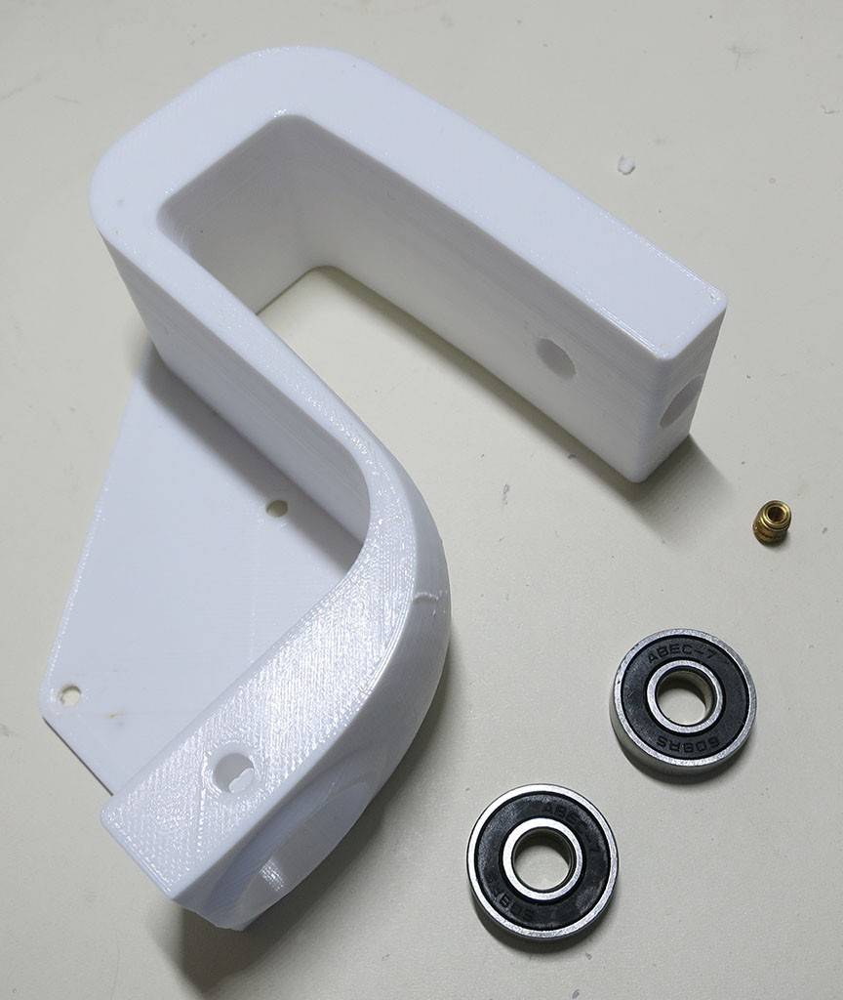
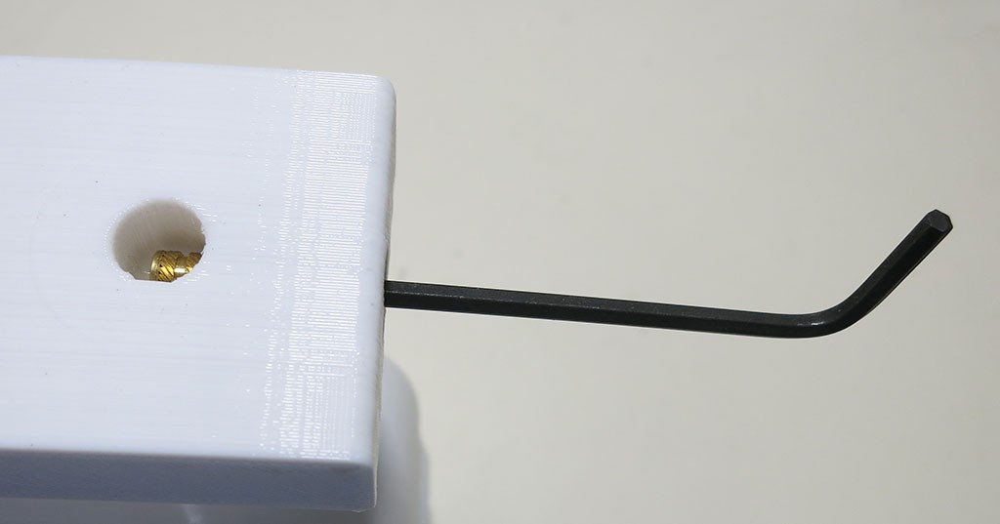
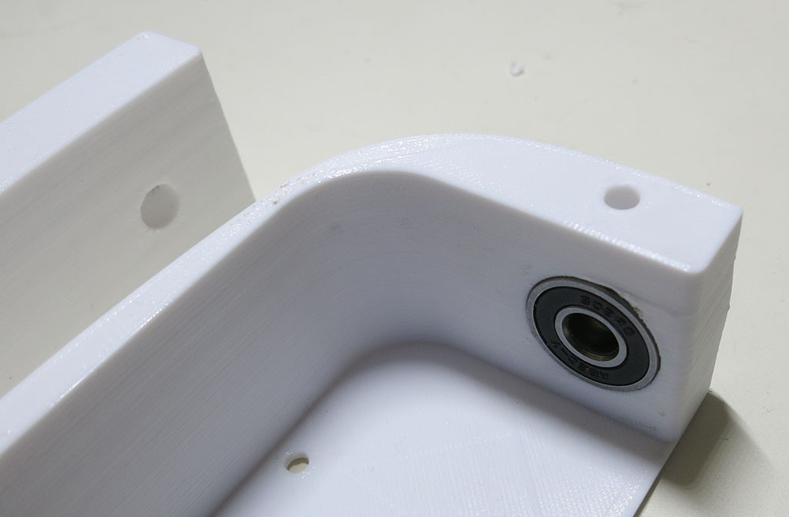
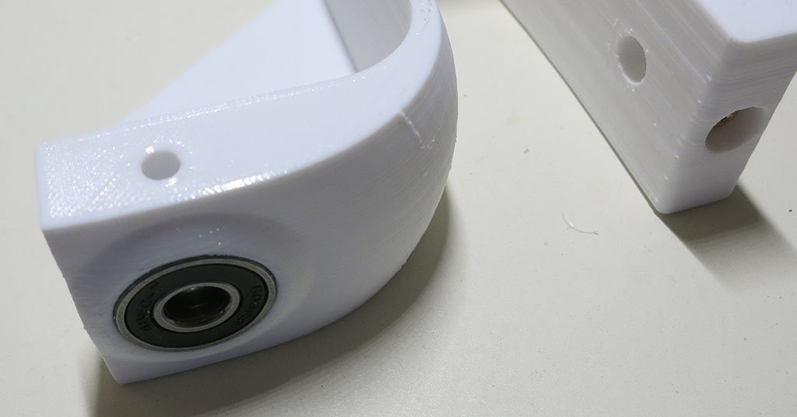
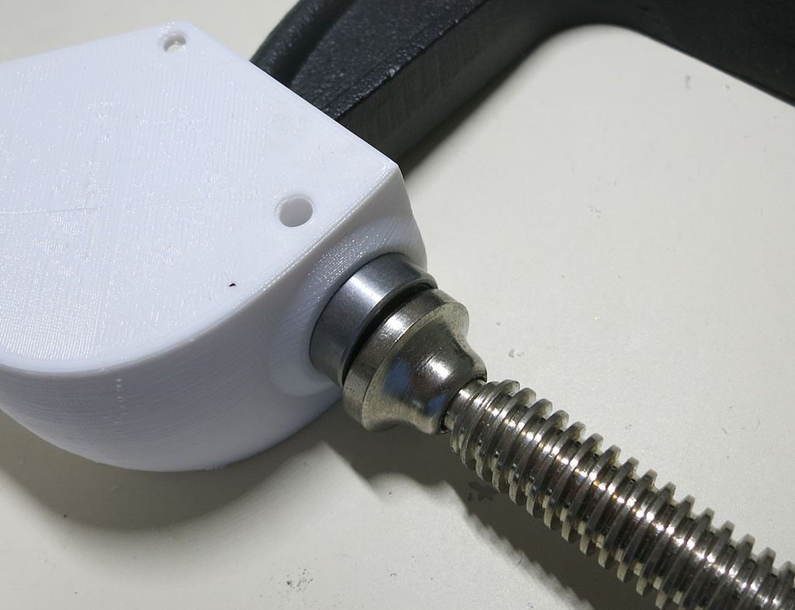

# Steering Knuckle

The steering knuckle connects the steering shaft to the driving shaft. Its convoluted shape 
was dictated by its [design constraints](https://newscrewdriver.com/2018/05/16/sawppy-the-rovers-steering-knuckle/) 
and it is a key part of rover suspension geometry.

**CAD source** [Wheel Parts](https://cad.onshape.com/documents/43678ef564a43281c83e1aef/w/392bbf8745395bc24367a35c/e/97ee620b9a27889d24f20c4d)

**3D Printing STL File:** [Steering Knuckle.stl](../STL/Steering%20Knuckle.stl)

**3D Printing Notes:**
* This object has all the dimension-critical feature types found in this project, 
it may require several prints to tune your 3D printing settings.
  * M3 thread heat-set inserts.
  * 8mm hole for steering shaft.
  * 22mm hole for 608 type bearing.
* We will need four of these objects, one for each corner. Mirroring two them is an optional aesthetic choice.
* Example print durations:
  * Fast PLA rough draft: 4.25 hours each * 4 knuckles = 17 hours total.
  * Slow PETG final draft: 8.75 hours each * 4 knuckles = 35 hours total.

The 22mm hole for 608 type bearing is large and it is likely your printer couldn't print a clean top edge.
This is OK and might even be an advantage! If your hole is slightly too large, these little pieces of 
dangling filament can help wedge the bearing in place.

**Post-Processing**

Estimated time: 9 minutes per knuckle * 4 knuckles = 36 minutes total.

**Tools:**
* Drill with 8mm reamer
* Soldering iron
* M3 bolt with washer and hex wrench.
* (optional) C-clamp

**Parts:**
* 3D printed steering knuckle
* M3 thread heat set insert
* 2 * Type 608 bearings

Clean up the 8mm hole for the steering shaft with 8mm reamer.

Install M3 thread heat-set insert.

Install bearings in their holes, one inside and one outside. Ideally they should be a snug finger-press fit. 

If the holes are slightly too large, the bearings might fall out until drive shaft is installed with
retaining clips. If the holes are far too large the rover's wheel direction would be unpredictable
causing erratic travel motion. It may be best to adjust your settings and print a new knuckle.

If the holes are slightly too small, use a C-clamp or similar tool to help install the bearings.
(The best tool is an arbor press, if you have access to one.) If the hole is far too small, you
can try carving out the excess plastic but it is hard to keep the bearings centered that way. It
may be best to adjust your settings and print a new knuckle.

