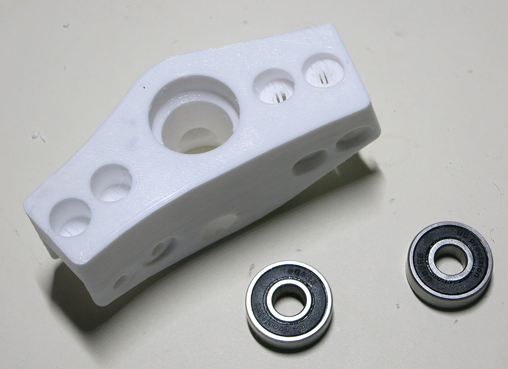
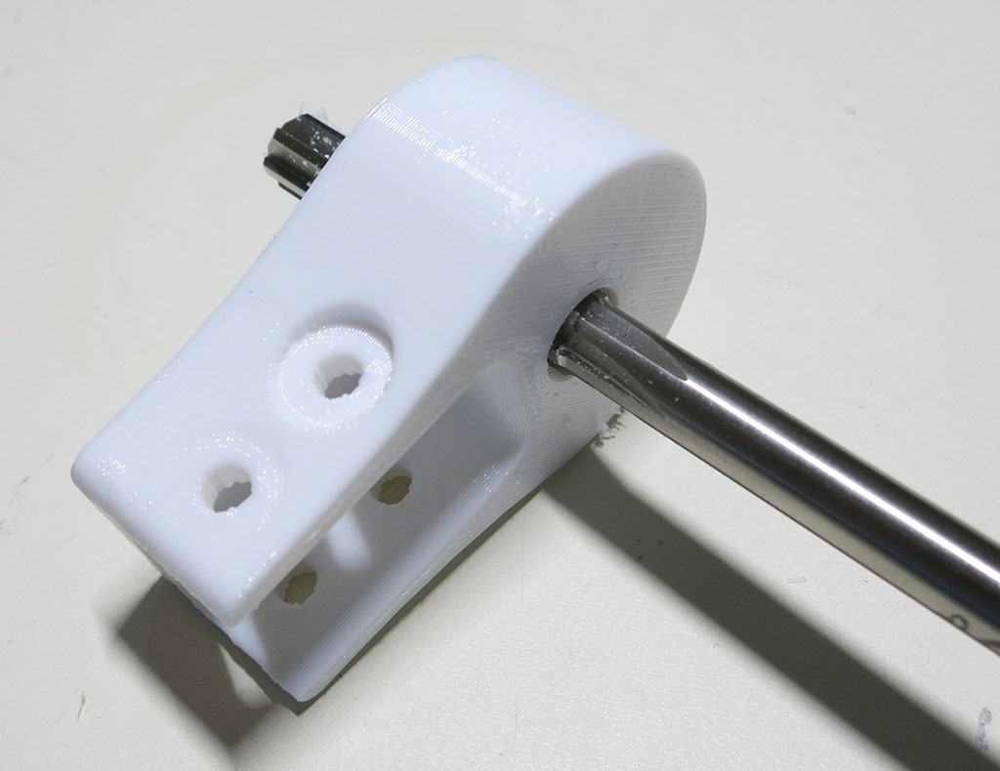
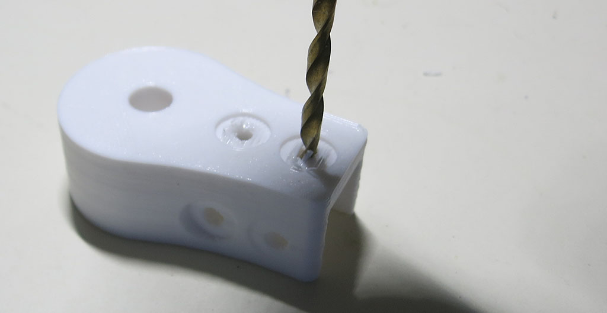

# Suspension Bogie Joint

These two parts build a pivot joint for the bogie portion of Sawppy's [Rocker-Bogie suspension](https://en.wikipedia.org/wiki/Rocker-bogie).

**CAD source** [Bogie Joint](https://cad.onshape.com/documents/43678ef564a43281c83e1aef/w/392bbf8745395bc24367a35c/e/bc12cd957a8285083c1ffbad)

### Bogie Pivot

This part houses the two type 608 bearings and two aluminum extrusion beams, one connecting to mid wheel assembly
and the other connecting to rear corner wheel assembly.

**3D Printing STL File:** [Bogie-Wheels.stl](../STL/Bogie-Wheels.stl)

**3D Printing Notes**
* We will need 2 of these, mirror-image of each other. One for each side.
* Example print durations:
  * Fast PLA rough draft: 2 hours each * 2 sides = 4 hours total.
  * Slow PETG final draft: 4 hours each * 2 sides = 8 hours total.

**Post-Processing:**

Estimated time: 2 minutes per corner * 2 sides = 4 minutes total.

**Parts:**
* 2 * 3D printed bogie pivot
* 4 * 608 type bearings

Use a drill to remove bridge assist layers on 4 bolt holes facing the print bed.

Install two bearings - one left and one right - onto each pivot piece.

### Bogie Fixed

This will become part of the rocker assembly, housing the 8mm shaft the bogie will pivot on.

**3D Printing STL File:** [Bogie-Body.stl](../STL/Bogie-Body.stl)

**3D Printing Notes**
* We will need 2 of these, mirror-image of each other. One for each side.
* Example print durations:
  * Fast PLA rough draft: 1 hours each * 2 sides = 2 hours total.
  * Slow PETG final draft: 1.5 hours each * 2 sides = 3 hours total.

**Post-Processing:**

Estimated time: 2 minutes per corner * 2 sides = 4 minutes total.

Use a reamer to clean up the 8mm hole for bogie pivot shaft.

Use a drill to remove bridge assist layers on 2 bolt holes facing the print bed.

