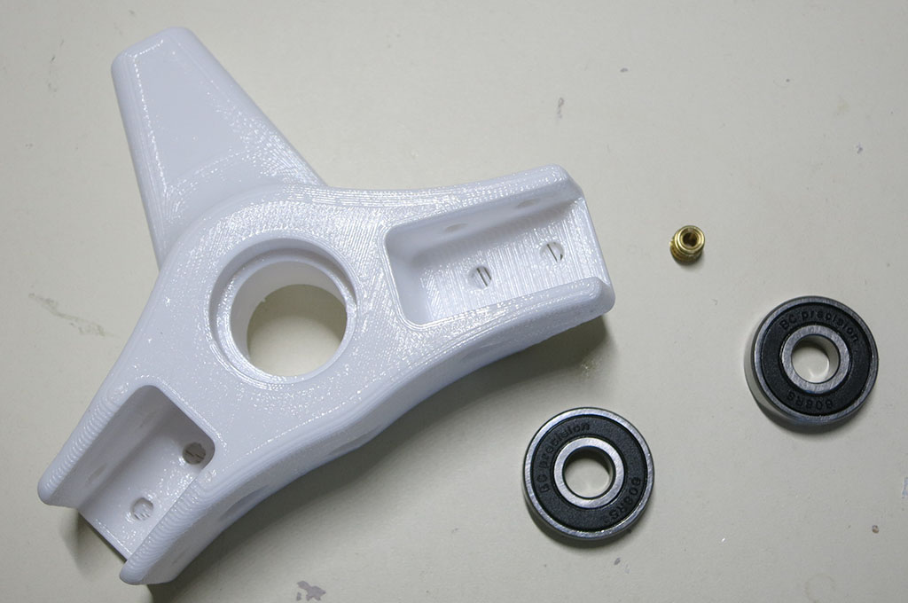
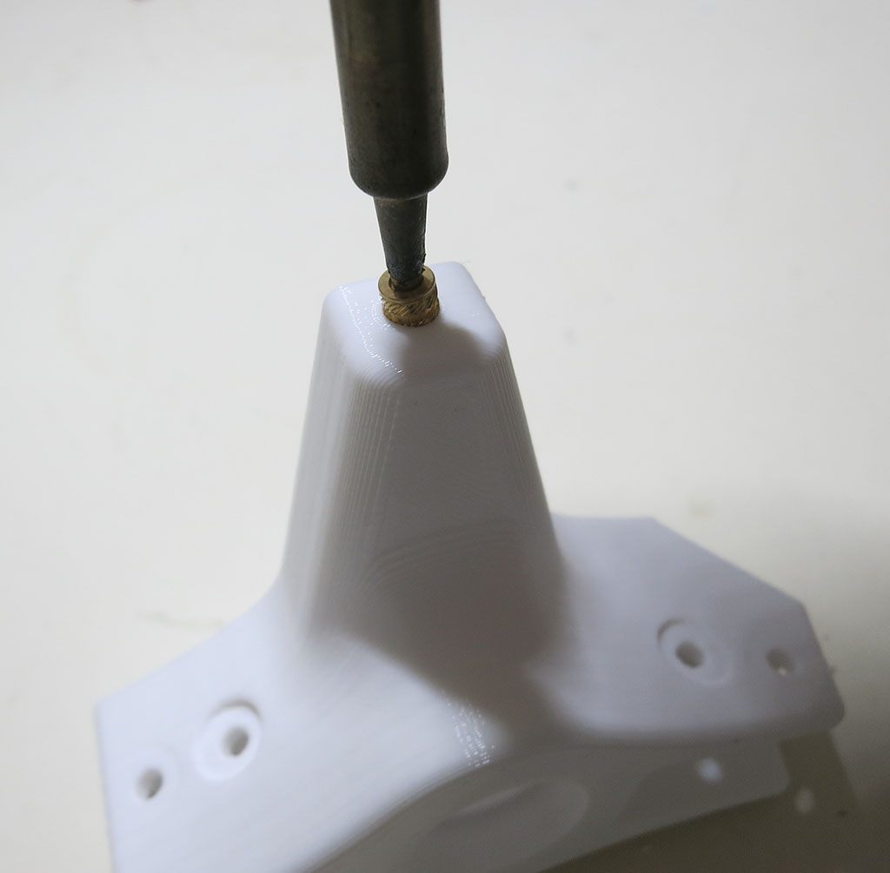
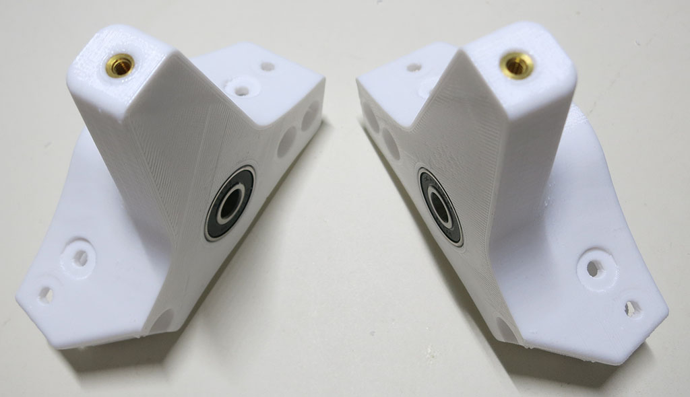
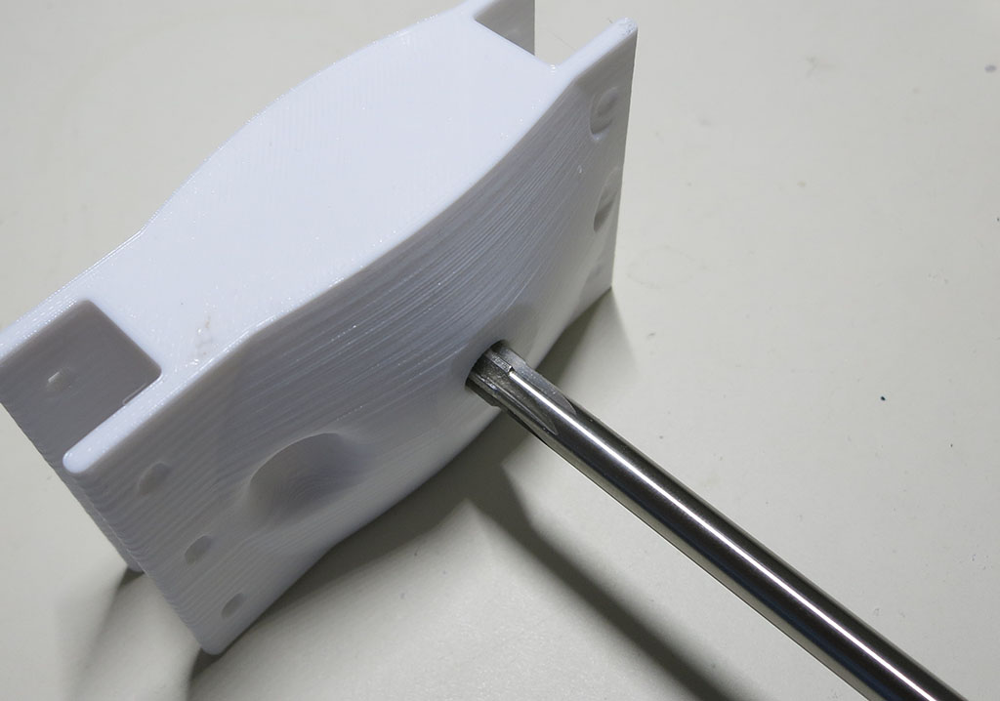

# Suspension Rocker Joints

These parts make up the main suspension pivot point against the main chassis box.

### Rocker

This part houses the two bearings for the rocker assembly to pivot on, and connects to two aluminum extrusion beams.
One leading to the bogie pivot joint, the other leading to a front corner. The top of this part connects to the
suspension differential.

**CAD source** [Rocker](https://cad.onshape.com/documents/43678ef564a43281c83e1aef/w/392bbf8745395bc24367a35c/e/4a687fb6a85c60c7ec293eb2)

**3D Printing STL File:** [Rocker.stl](../STL/Rocker.stl)

**3D Printing Notes**
* We will need 2 of these, mirror-image of each other. One for each side.
* Example print durations:
  * Fast PLA rough draft: 3 hours each * 2 sides = 6 hours total.
  * Slow PETG final draft: 5.5 hours each * 2 sides = 11 hours total.

**Post-Processing:**

Estimated time: 3 minutes each * 2 units = 6 minutes total.

**Parts:**
* 2 * 3D printed pieces, one mirror of the other.
* 4 * bearings
* 2 * M3 thread heat set inserts

Remove thin bridge assist layers from four bolt holes facing the print bed.

Install M3 thread heat-set insert for future connection to differential.

Install bearings.

### Rocker body mount

This part connects the rocker-bogie suspension of one side to the main chassis equipment box. It holds
the 8mm shaft for the suspension to pivot upon, and bolts to the two lengthwise body extrusion beams.

**CAD source** [Box body mounts](https://cad.onshape.com/documents/43678ef564a43281c83e1aef/w/392bbf8745395bc24367a35c/e/4b42dffa042b70b94b3d0d85)

**3D Printing STL File:** [Rocker Body Mount.stl](../STL/Rocker%20Body%20Mount.stl)

**3D Printing Notes**
* We will need 2 of these. This part is symmetric so no need for mirroring.
* Example print durations:
  * Fast PLA rough draft: 3.5 hours each * 2 sides = 7 hours total.
  * Slow PETG final draft: 8 hours each * 2 sides = 16 hours total.

**Post-Processing:**

Estimated time: 1 minutes each * 2 units = 2 minutes total.

Use 8mm reamer to clean up hole for suspension pivot shaft.

