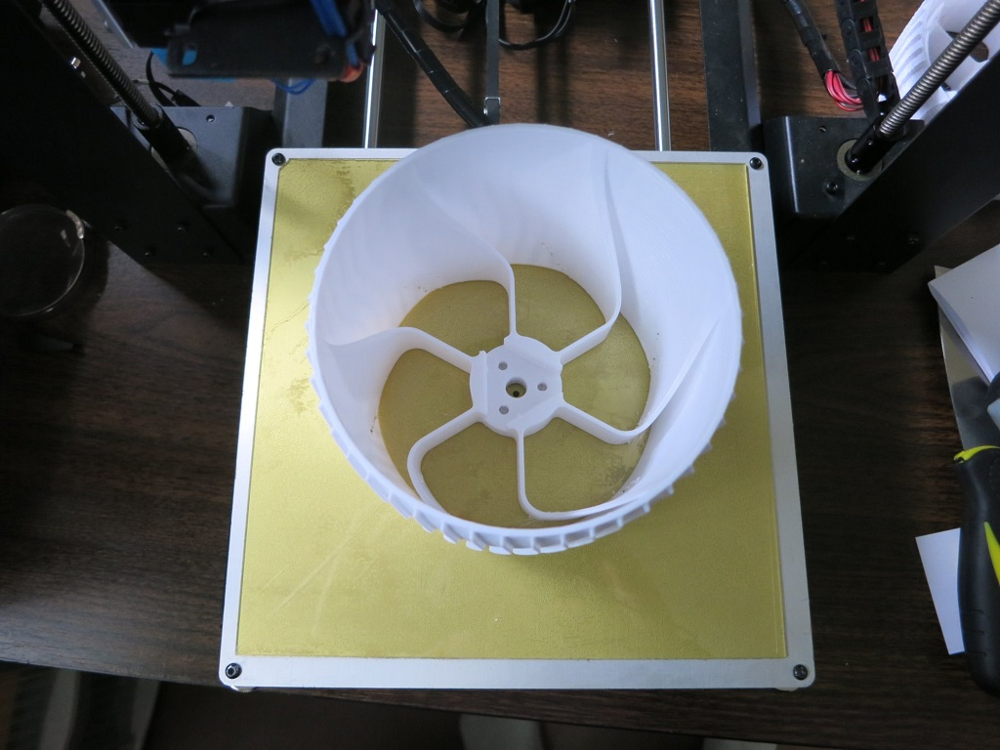
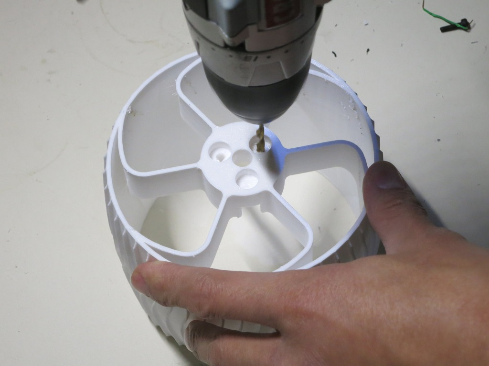

# Wheel

The rover wheel is the most intricate, time-consuming part to print.
It will likely require a few tries while tuning 3D slicer for optimal output.

**CAD source** [Wheel Parts](https://cad.onshape.com/documents/43678ef564a43281c83e1aef/w/392bbf8745395bc24367a35c/e/97ee620b9a27889d24f20c4d)

**3D Printing STL File:** [Wheel.stl](../STL/Wheel.stl)

**3D Printing Notes:**
* The wheel is designed to print without supports, outer face of the wheel against the bed.
* The wheel spoke and perimeter is an even multiple of nozzle diameter and should print in a few large continuous motions.
But the thin dimensions could confuse some slicers. If it generates paths broken up into an excessive number of segments, adjust your slicer settings.
* The rover will need 6 wheels. Printing half of them in a left/right mirror-image is an optional aesthetic choice.
Note that the [real Curiosity rover](https://www.jpl.nasa.gov/video/details.php?id=910) does not left/right mirror its wheel spoke design.
* Example print durations:
  * Fast PLA rough draft: 7.5 hours per wheel * 6 wheels = 45 hours total
  * Slow PETG final draft: 12 hours per wheel * 6 wheels = 72 hours total

**Post-Processing**

Estimated Time: 2 minutes per wheel * 6 wheels = 12 minutes total.

**Tools:**
* 8mm reamer with drill
* 4mm or 5/32" drill bit, slightly smaller is OK as precision does not matter.

**Parts**
* 3D printed rover wheel

There is a thin layer of filament to help our printer bridge the bolt hole during printing. Now that printing is complete,
they are no longer necessary and should be removed with the 4mm (or smaller) drill bit. In this image, one hole has been
cleaned up, one is in progress, and one awaits cleanup.

We want our 8mm steel drive shaft to fit snugly within the wheel's center. To help with this, use an 8mm reamer
to bring the center hole into precise dimension.

