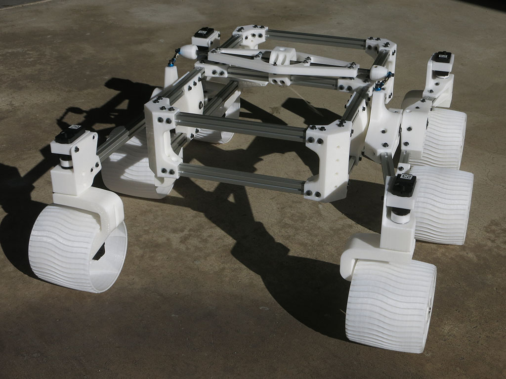
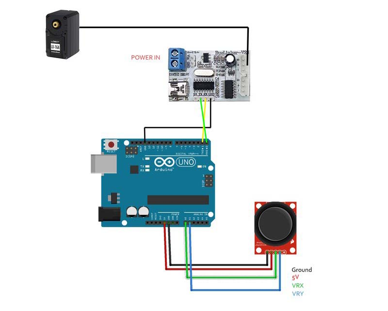

# Instructions

This directory has information for building your own Sawppy the Rover.
Some of the tools required are listed in the [tools list](Tools.md).

## 3D Printed Components
[General overview](Print%20Overview.md) of 3D-printed rover parts.

Details:
* [Servo accessories](Print%20Servo%20Parts.md)
* [Steering knuckle](Print%20Steering%20Knuckle.md)
* [Fixed knuckle](Print%20Fixed%20Knuckle.md)
* [Wheel](Print%20Wheel.md)
* [Wheel hub](Print%20Wheel%20Hub.md)
* [Corner Steering Joints](Print%20Corner%20Steering%20Joints.md)
* [Suspension Bogie Joints](Print%20Suspension%20Bogie%20Joints.md)
* [Suspension Rocker Joints](Print%20Suspension%20Rocker%20Joints.md)
* [Main Body Box Corners](Print%20Body%20Box%20Corners.md)
* [Differential](Print%20Differential.md)
* [M3 Nut Installation Tool](Print%20M3%20Installation%20Tool.md)

## Customized Metal Components
* [15mm square aluminum extrusion beams](Misumi%20HFS%203.md)
* [8mm diameter shafts](Shaft8mm.md)

## Mass-produced Components
* __Turnbuckles__ are used to connect both sides of rocker-bogie suspension together,
see the end of [this document](AssembleRocker.md). The two connection endpoints
need to accomodate M3 fasteners as used in the rover, and the distance between
connection endpoints should be roughly 5cm - 7.5cm. Example:
[Hobbypark 16617](https://www.amazon.com/dp/B01H5PZKMK)
is seen in the assembly pictures.
* __"608" Bearings__ are widespread. It's the type used in products like
rollerblades, skateboards, and scooters. Since Sawppy does not run bearings at
high speeds or put heavy loads on them, expensive
[industrial strength 608 bearings](https://www.mcmaster.com/608-ball-bearings)
are unnecessary. Shop around for
[inexpensive alternatives](https://www.amazon.com/dp/B073ST742Z),
they'll probably suffice for a hobbyist rover.
* __M3 Heat Set Inserts__ give metal threads for 3D-printed parts which are more
durable than threads tapped into printed plastic. Sawppy's default design is sized
for [these inserts](https://www.amazon.com/gp/product/B077CHFGVT) on my printer,
and reportedly works well with [these inserts](https://www.mcmaster.com/94180a333)
as well.
* [Purchased Parts List](Parts%20List.md)

## Mechanical Assembly
For an overview of the construction technique used here, combining aluminum extrusion beams with
3D printed connectors plus using design-specific M3 nut installation tools, please
[see this article on Hackaday.com](https://hackaday.com/2018/05/08/how-to-build-anything-out-of-aluminum-extrusion-and-3d-printed-brackets/).

If any part of the assembly instructions are unclear, consult
[the CAD file](https://cad.onshape.com/documents/43678ef564a43281c83e1aef/w/392bbf8745395bc24367a35c/e/9bd6bbb7aba50a97523d14f2)
to see how parts are supposed to fit together.

* [Servo Actuator Module](AssembleActuatorModule.md)
* [Wheel Drive Modules](AssembleDriveModules.md)
* [Suspension Pivot Joints](AssemblePivotJoints.md)
* [Main Rover Body](AssembleBody.md)
* [Suspension Differential](AssembleDifferential.md)
* [Suspension Bogie](AssembleBogie.md)
* [Suspension Rocker and final assembly](AssembleRocker.md)

Once all the wheels are attached to the suspension via M3x16mm bolts, your Sawppy will be mechanically complete!

## Electronic Schematic

A bare-bones Sawppy build will have the following electronic components:
* A 2-cell lithium polymer battery. (Visible in pictures is a 30C 5200mAh RC
monster truck battery)
* A power switch
* Because the battery can deliver up to 150A and nothing on the rover can
tolerate more than a few amps, a [10A fuse to protect against short circuits](https://newscrewdriver.com/2018/06/06/powering-sawppy-the-rover/  ).
* A volt meter to monitor battery voltage.
* A [voltage regulator](https://newscrewdriver.com/2017/07/27/powering-the-raspberry-pi-3-with-mp1584-voltage-step-down-converter/) to convert battery power to 5V.
* A Raspberry Pi 3 powered by 5V regulator output, either via micro USB port or GPIO voltage pins.
* A USB cable connecting Raspberry Pi 3 to serial bus translator board.
* Ten serial bus servos connected in parallel to the translator board.

Optional components visible in some Sawppy pictures:
* A [USB webcam](https://newscrewdriver.com/2018/06/19/sawppy-the-backyard-rover/).
* Google [AIY Vision kit](https://newscrewdriver.com/2018/06/18/sawppy-the-rovers-mast-cameras/).
* A dual-band wireless router for [greater range and access to 5GHz band](https://newscrewdriver.com/2018/07/15/sawppy-the-rover-receives-wifi-upgrade-increases-range/).

# Control Software

There are many different options to control a Sawppy rover.

## Browser-Based UI

For driving Sawppy like a remote controlled vehicle (a.k.a. 'teleoperation')
using a web browser-based control interface,
Sawppy can borrow software from [SGVHAK Rover](http://bit.ly/sgvhak_rover).
See [instructions to modify SGVHAK Rover software to Sawppy](SGVHAK%20Rover%20Software.md).

## Traditional RC Receiver

Rover builders who prefer a more traditional remote control unit can draw from
[Marco Walther's implementation](https://github.com/mw46d/SGVHAK_Rover).

## Robot Operating System (ROS) by Rhys Mainwaring

For experiments in autonomous operation using ROS, please see 
[Rhys Mainwaring's Curio rover project.](https://github.com/srmainwaring/curio)
This is a completely different rover control software
stack built on ROS Melodic, including support for RViz visualization and Gazebo
simulation, plus a way to extract useful odometry data from servo position reports
that are only accurate in a ~240 arc out of 360 degrees.

## Wired Arduino

As an alternative to Raspberry Pi based wireless control, there is now an
option to build Sawppy as a wired control rover. This avoids wireless
communication issues in crowded environments (like a Maker Faire) and can
be kept as a backup option. Alternatively, it allows interfacing with
anything that can communicate with an Arduino. Code for Arduino sketch is
under the [arduino_sawppy](../arduino_sawppy) directory.

Here's a wiring diagram contributed by [Martin](https://hackaday.io/Plaville)

