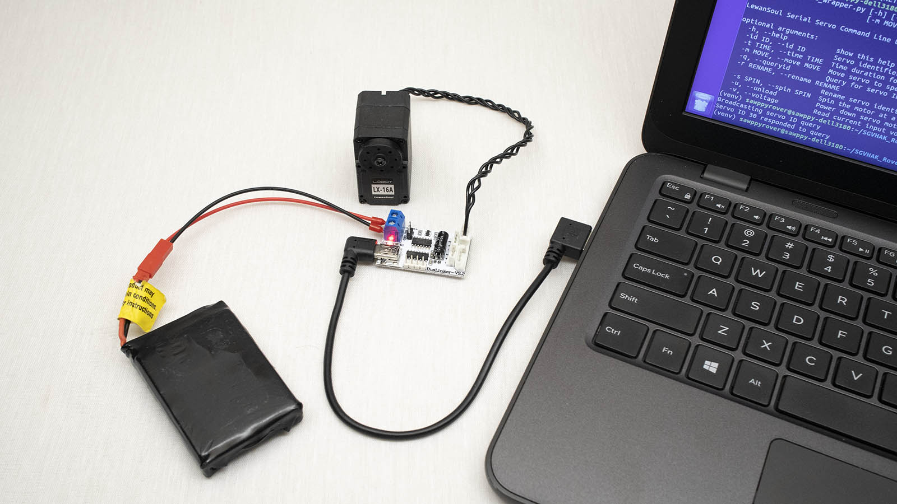

# SGVHAK Rover Software

While the long-term vision for Sawppy is an autonomous vehicle running on [ROS](http://www.ros.org/)
we have an interim software solution adapted from [SGVHAK Rover](http://bit.ly/sgvhak_rover).
Sawppy running SGVHAK rover software will present a web-based user interface
turning a touchscreen into a joystick to drive a rover as a remote-control
car. (Mouse click and drag can also be used on non-touchscreen devices.) This
is also called a 'teleoperation' mode.

Clone the [SGVHAK Rover software repository](https://github.com/Roger-random/SGVHAK_Rover) 
and follow instructions to install dependencies. (Optional installation of ```virtualenv```
and required installation of Python libraries ```pip install -e .```)
Before proceeding to step "Start Flask", make the modifications below.

The information below are specific to the LewanSoul serial bus servos used
on first Sawppy implementation, but the general concept are applicable to
alternative serial bus servos with modification.

# Before Rover Wiring: Assign Unique ID To Each Servo

Sawppy has ten LewanSoul serial bus servos wired in parallel. In order to tell
them apart, each servo must have an unique identifier different from any other
servo on board the rover. By default, every servo is assigned id #1 at the
factory and must be renamed one at a time. This procedure is also an
opportunity to verify the BusLinker a.k.a. Debug Board is working.

For this step, connect a single servo to BusLinker. Connect a two-cell LiPo
battery to BusLinker power inputs Vin and GND to power the servo. Connect USB
cable to computer.



For Linux (such as Raspberry Pi's Debian or Ubuntu Linux on laptop visible in
picture) run the ```dmesg``` command immediately after plugging in the USB cable
to see which port it has been assigned. The final few lines of output from
running ```dmesg``` should look similar to the following:

```
[ 2980.395126] usb 2-3: new full-speed USB device number 15 using xhci_hcd
[ 2980.568517] usb 2-3: New USB device found, idVendor=1a86, idProduct=7523
[ 2980.568524] usb 2-3: New USB device strings: Mfr=0, Product=2, SerialNumber=0
[ 2980.568528] usb 2-3: Product: USB2.0-Serial
[ 2980.571592] ch341 2-3:1.0: ch341-uart converter detected
[ 2980.582703] usb 2-3: ch341-uart converter now attached to ttyUSB0
```

Write down the final piece of information (in this example ```ttyUSB0```) and
edit the file [```config_lewansoul.json```](https://github.com/Roger-random/SGVHAK_Rover/blob/master/config_lewansoul.json). 
Edit line 4 value for ```port``` accordingly. Once configured, we can run the
LewanSoul support code in [```lewansoul_wrapper.py```](https://github.com/Roger-random/SGVHAK_Rover/blob/master/SGVHAK_Rover/lewansoul_wrapper.py)
as a standalone command line utility. Run it with the command line
```python SGVHAK_Rover/lewansoul_wrapper.py``` and the following help screen
should be displayed.

```
~/SGVHAK_Rover$ python SGVHAK_Rover/lewansoul_wrapper.py
usage: lewansoul_wrapper.py [-h] [-id ID] [-t TIME]
                            [-m MOVE | -q | -r RENAME | -s SPIN | -u | -v]

LewanSoul Serial Servo Command Line Utility

optional arguments:
  -h, --help            show this help message and exit
  -id ID, --id ID       Servo identifier integer 0-253. 254 is broadcast ID.
  -t TIME, --time TIME  Time duration for action
  -m MOVE, --move MOVE  Move servo to specified position 0-1000
  -q, --queryid         Query for servo ID
  -r RENAME, --rename RENAME
                        Rename servo identifier
  -s SPIN, --spin SPIN  Spin the motor at a specified speed from -1000 to 1000
  -u, --unload          Power down servo motor
  -v, --voltage         Read current input voltage
```

With a single LewanSoul serial bus servo connected, send an ID broadcast
query to determine its current ID. If it is new from factory, it is likely
to have ID of 1.

```
~/SGVHAK_Rover$ python SGVHAK_Rover/lewansoul_wrapper.py -q
Broadcasting servo ID query
Servo ID 1 responded to query
```

Change this servo's ID. This example shows changing ID from 1 to 30.

```
~/SGVHAK_Rover$ python SGVHAK_Rover/lewansoul_wrapper.py --id 1 --rename 30
Checking the specified servo ID 1 is on the serial network.
Checking the specified destination servo ID 30 is not already taken.
Renaming servo ID 1 to 30
Verifying the servo now answers to new ID
Servo successfully renamed to ID 30
```

Give each of our ten servo their own individual ID. The exact values are not
important but they must be ten different IDs. If desired to copy reference
Sawppy implementation, give them ID #20 through #29. Mark each servo with 
their new ID for reference. Sawppy visible in pictures used a label maker
to record each servo ID.

# Servo Placement During Construction

Take note of servo ID in each location. If desired to copy reference Sawppy
implementation, here is a table of servo position along with their ID. This
information is duplicated in [```config_sawppy.json```](https://github.com/Roger-random/SGVHAK_Rover/blob/master/config_sawppy.json)
in JSON format.

|Left |Rolling|Steering| |Steering|Rolling|Right|
|-----|-------|--------|-|--------|-------|-----|
|Front|     25|      23| |      29|     27|Front|
|Mid  |     21|        | |        |     22|Mid  |
|Rear |     20|      24| |      26|     28|Rear |

# Rover Suspension Geometry

If a rover has been modified in a way that changes its suspension geometry
such that wheel positions have shifted, their position needs to be updated
in [```config_sawppy.json```](https://github.com/Roger-random/SGVHAK_Rover/blob/master/config_sawppy.json)
for proper calculation of [Ackermann steering](https://en.wikipedia.org/wiki/Ackermann_steering_geometry)
angles on each of four corner wheels. See section "Physical Geometry" under
"Configurations and Modifications" of [SGVHAK Rover instructions](https://github.com/Roger-random/SGVHAK_Rover).

# Rover Steering Servo Trim

Once rover is standing on its own wheels, use the command line utility again
this time to find center positions for all four steering servos. In a perfect
world a servo's center position 500 will be where a wheel points straight ahead,
but realities of construction mean each rover will have slightly different values.

This example shows starting with 500 then trying position on either side of
center: 510 and 490.

```
:~/SGVHAK_Rover$ python SGVHAK_Rover/lewansoul_wrapper.py --id 30 --move 500
Moving servo 30 to position 500
:~/SGVHAK_Rover$ python SGVHAK_Rover/lewansoul_wrapper.py --id 30 --move 510
Moving servo 30 to position 510
:~/SGVHAK_Rover$ python SGVHAK_Rover/lewansoul_wrapper.py --id 30 --move 490
Moving servo 30 to position 490
```

Update [```config_sawppy.json```](https://github.com/Roger-random/SGVHAK_Rover/blob/master/config_sawppy.json)
with correct center position for each of four steering servos.

NOTE: SGVHAK rover software menu has a "Steering Trim" menu item, but that is
specific to RoboClaw controller used by SGVHAK rover and does not apply to
Sawppy rover.

# Overwrite Rover Chassis Configuration File

Once our ```config_sawppy.json``` has been properly updated, copy
it over ```config_roverchassis.json``` to overwrite SGVHAK rover 
configuration with Sawppy configuration.

# Start Flask

Now our clone of SGVHAK rover software has been reconfigured for our Sawppy
rover build, and we can resume [SGVHAK Rover instructions](https://github.com/Roger-random/SGVHAK_Rover)
from step 'Start Flask' onwards.