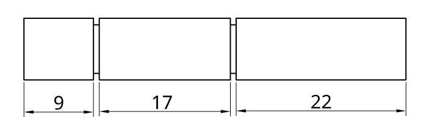
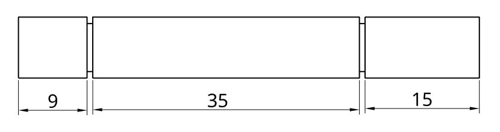
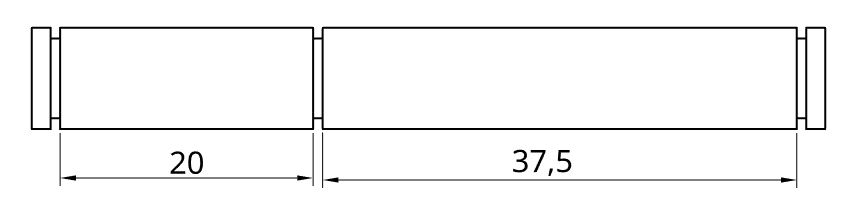
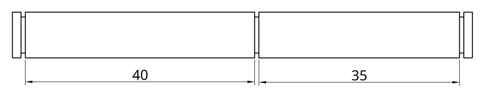

# 8mm metal shafts

Sawppy the Rover uses 8mm shafts anywhere there is a rotary motion that whose load is borne by 608 type bearings.
* Wheel axle drive shaft for all 6 wheels.
* Steering shaft for 4 corner motors.
* 2 Suspension bogie pivot point, one on each side.
* 2 Suspension rocker pivot point, one on each side.

Below are instructions on how to build your own shafts.

## Shaft stock selection

Any metal shaft should work, as long as it has the appropriate 8mm diameter to fit snugly within 608 type bearings used.
As these shafts are not spun to high speeds, carry high torque, or mesh with other machinery, Sawppy does not require
high precision industrial machinery shafts. (Example: unnecessarily expensive high precision shafts from
[Misumi](https://us.misumi-ec.com/vona2/detail/110300086920/?ProductCode=SFMR8-300)
and [McMaster-Carr](https://www.mcmaster.com/1265k64)) Low precision round bar stock are a fraction of the cost and will
suffice. The worst that would happen with low precision shafts is that wheels may be a little wobblier.

Aluminum shafts (example: McMaster-Carr [catalog #4634t34](https://www.mcmaster.com/4634t34)) are inexpensive and strong
enough for normal rover operation. If the rover will be carrying additional equipment, or taken to public events with
exposure to young children, consider upgrading to steel shafts for extra strength. (Example: McMaster-Carr
[catalog #8920k26](https://www.mcmaster.com/8920k26) is used in the rover seen in assembly pictures.)

## Retaining clips

The shafts are kept in place by small retaining clips. (Sometimes called e-clips.) The precise size of these clips
are not critical for rover function, they just need to be small enough to grip on a groove in a 8mm diameter shaft
and large enough to hold against a 608 bearing. The clips used in the assembly pictures are McMaster-Carr
[catalog #97431a310](https://www.mcmaster.com/#97431a310) designed for 5/16-inch shafts.

## Grooves for retaining clips

The retaining clips will need grooves cut into the shafts. Ideally this can be done on a metalworking lathe, but
it can be done with a drill and a high speed motor ("Dremel") tool in a [poor-man's lathe](https://newscrewdriver.com/2018/05/18/poor-mans-lathe-cutting-a-steering-shaft-with-drill-and-dremel/).
And there are many options in between, limited only by your resourcesfulness and creativity.

## Detents for set screws

The driving and steering shafts will need a flat detent cut into them for set screws. If precise metalworking
tools are not available, they can be cut by [clamping the shaft in a vise and use a metal file](https://newscrewdriver.com/2018/06/20/improve-motor-shafts-with-larger-flatter-detents-and-apply-loctite-to-set-screws/).

## Dimensions

These drawing dimensions are in millimeters, and they are incomplete because the precise width of retaining grooves
will depend on the retaining clip used and also on what tools are available to cut those grooves. For the rocker and bogie
shafts, their end pieces can be as narrow as fabrication technique (and skill) permit, but 1-2mm is a good target range.

#### Wheel axle drive shaft

Make 6 copies, one for each wheel. The 9mm segment is for servo coupler and needs detent. The 22mm segment is
for a wheel, and the inside edge will be for the wheel hub and needs a detent.

#### Steering shaft

Make 4 copies, one for each corner. The 9mm segment is for servo coupler and needs detent. The 15mm segment is
for a steering knuckle and needs a detent at its center.

#### Bogie pivot shaft

Make 2 copies, one for each side. No detents necessary.

#### Rocker pivot shaft

Make 2 copies, one for each side. No detents necessary.

