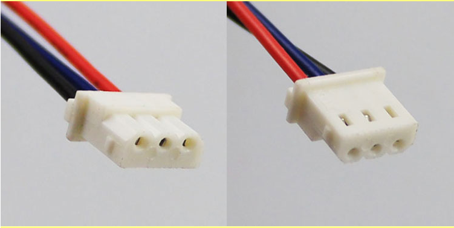
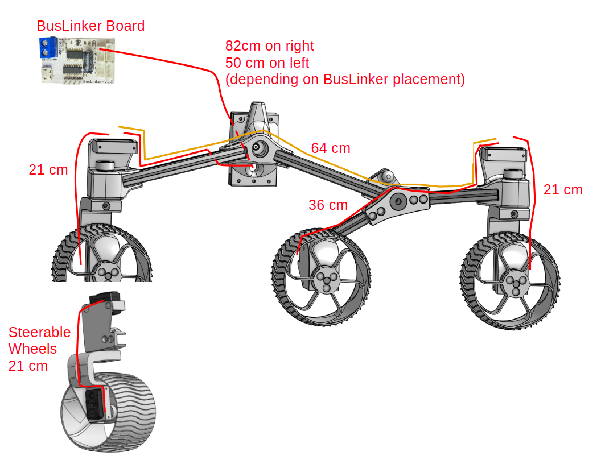
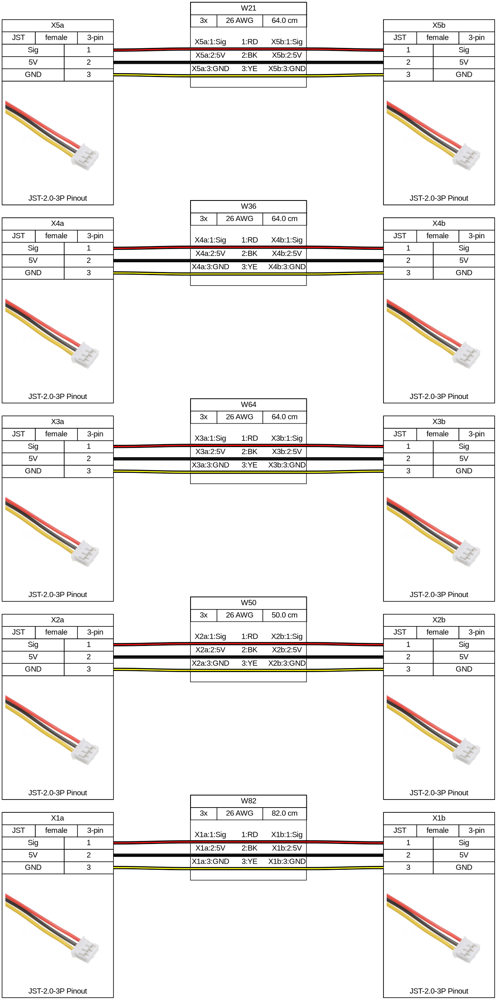

# Wiring

The wiring harness connects each of the motors to the BusLinker board on the
body panel with a cable.

## Terminology
Some notes on termininology (with acknowledgement to
[this NASA JPL Open Source Rover wiring documentation](https://github.com/nasa-jpl/open-source-rover/tree/master/electrical/wiring):
* *Wiring harness* (also called cable harness or wire assembly): the collective term for all the wiring and cables that are run through a system to connect power sources, sensors, data lines, etc. In the case of the rover, this means the cables that feed power to the motors, the control signals to the servos, and the encoder data back to the control boards.
* *Cable*: A group of wires/conductors, usually with an outer sheath.
* *Wire*: A single conductor, solid or stranded core, of any gauge.

## Cables

There are many ways to construct your cables:
1) you can cut the small wires that come with your servos, and splice the cables to the middle.
2) you can purchase connectors that match your servos, as shown below.

Each end of each wire contains a connector to your servo motor:
* For the LX-16A, the Molex mini SPOX connector should be used.
    * [Mini-SPOX 5264 3 Position Housing](https://www.newark.com/molex/50-37-5033/connector-rcpt-3pos-1row-2-5mm/dp/57H1785)
    * [Mini-SPOX 5264 Socket](https://www.newark.com/molex/08-70-1040/contact-socket-22awg-crimp/dp/54H5573)
    * Each servo has two connectors, so you have to daisy chain them.
    * Here is an image of the connector:
      
* For the LX-224, you can use the JST-2.0-3P connector as shown below.
    * Each servo has three connectors, enabling chaining in serial and/or parallel.

## Harness
There are also several ways to construct your harness.  The bus servos have two or three connectors on them, which are electrically connected together pin-for-pin.  That is, they are electrically parallel.  Thus, you don't really need to worry about if your servos are connected in parallel or daisy-chained, so long as you connect them all pin-to-pin to the BusLinker board.

However you make your harness, it is recommended to enclose them in some sort of sleeve.  You can use the braided sleeves as described at (https://newscrewdriver.com/2018/06/14/expandable-braided-sleeves-neaten-sawppy-the-rovers-wiring/), or spiral wrap similar to (https://www.newark.com/abb-thomas-betts/srpe-250-9-c/spiral-wrap-pe-natural-0-25in/dp/61H6991), or even just judicious use of zip-ties.  But that's what bundles wires into a cable, and cables into a harness, which is much nicer to work with than a birds-nest of individual wires!

1) Knowing this, you can construct your harness to mimic the kinematic structure of the rover - put a Y connection at the rocker joint, another at the bogie joint, etc, then splice your extensions between these connectors.  This is what was done for the original sawppy.

2) You can also use the multiple connectors on the servos to simplify your harness.  That is what is documented below.

Wiring diagram for one side of the rover, for the LX-224 configuration.  The other side is identical, except for the cable going to the BusLinker board.  For the LX-16A, you'd need to connect your servos in series or make a break-out board.

Harness diagrams further below were generated with [WireViz](https://github.com/wireviz/WireViz/) and can be re-generated with the *generateHarness.bat/.sh* scripts.

In summary, for the LX-224 configuraiton, you need
* 1x: 82 cm cable from BusLinker to right front wheel
* 1x: 50 cm cable from BusLinker to left front wheel
* 2x: 64 cm cable from front steering servo to rear steering servo
* 2x: 36 cm cable from rear steering servo to middle drive servo
* 4x: 21 cm cables from drive servo to steering servo

