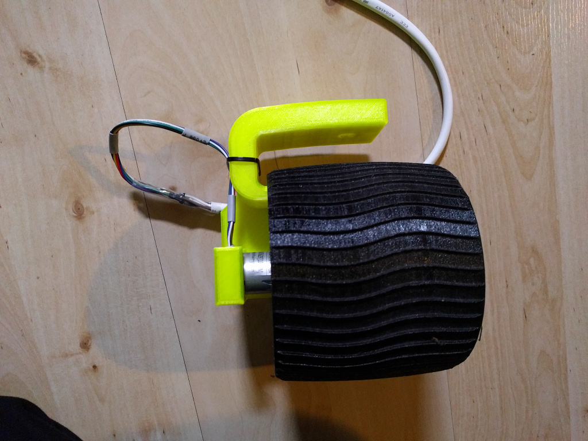
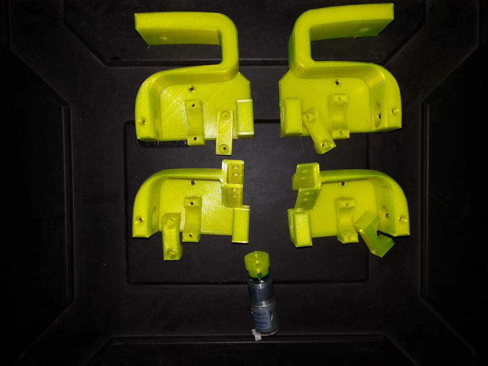
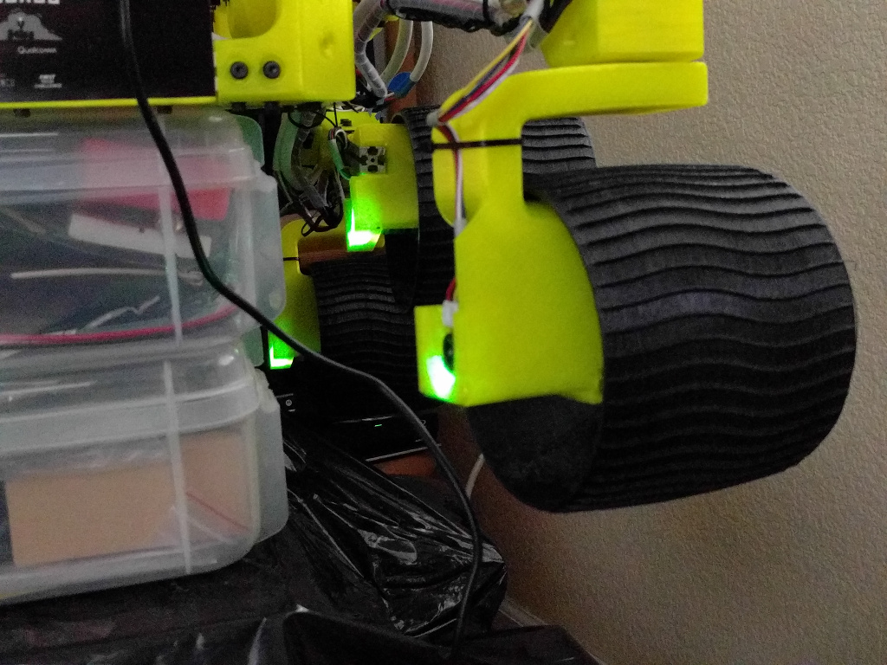
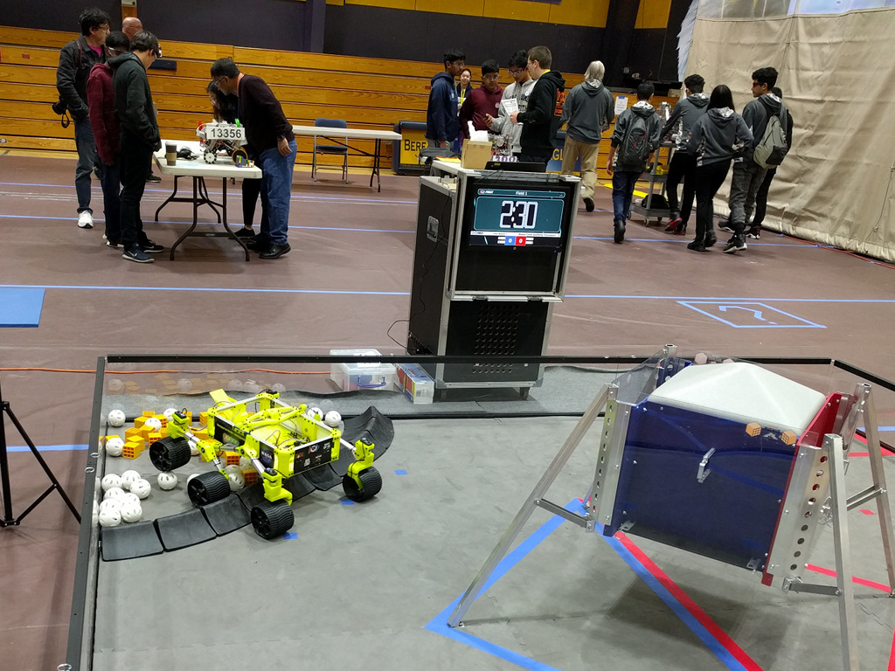

# mw46d Additions

* I created some extra parts to interface the Dynamixel AX-12's with the original parts. But my LX-17 servos arrived in time, so I did not really try the AX-12s.
* I created motified knuckles to use 25D geared motors with shaft-encoders.
(https://www.aliexpress.com/item/6V-100-210-300RPM-Encoder-Motor-DC-Gear-Motor-with-Worm-Gear-Torque-Locking/32914332902.html) I'm using the 100rpm versions of the motor
and they work very well and allow me to get the encoder readings and use those for speed/distance calculations. The only downside is, that I have to deal with many more
cables:-( Originally, each side had just three, now I have 3 (for the steering servos) + 3 * 6 (for the drive motors).

A little night excursion: https://youtu.be/rvCmtjlanaQ

