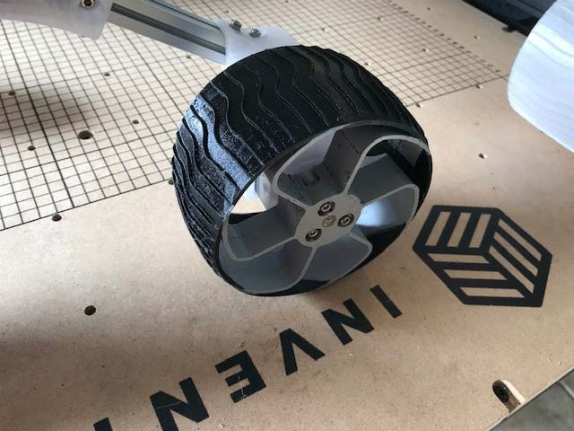
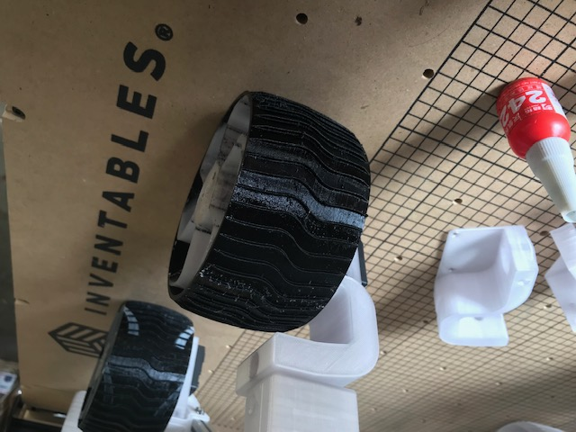
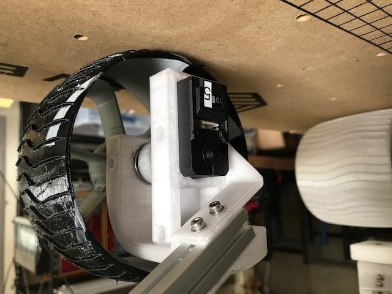

# Bob Krause, Inventor Studios

(The following information was first posted on Sawppy's Hackaday.io project
discussions section [here](https://hackaday.io/project/158208-sawppy-the-rover/discussion-116870))

_____

Our focus at this point is to increase the configurability of the design, as
you can see in the list of changes we’ve made so far that’s included below. 

* Wheel width can be changed
  * Wheel width changeable
  * Steerable knuckle width varies with wheel width
  * Fixed knuckle width varies with wheel width
* Wheel rim and tire can be printed as separate parts of a dual-extrusion
printer job
* Beam width & height can be changed
  * All 3D printed components that accept beams varies based on beam dimensions
* LX-16A brackets now accept heat-sets so that servos are held more tightly

* The geometry of the LX-16A bracket changed. 
  * The orientation of the servo is rotated 180 degrees to fit narrow knuckles
  and narrow tires.

The area we’re focusing on next is support for drive-train and control systems
that will move the bot much (much) faster than the LX-16A servos currently
allow. The first step in that direction is to design in FTC-compatible (First
Technical Challenge) components, which we have an almost endless supply of
parts laying around the lab. Driving a bogie suspended robot around on rough
terrian at high speedswill likely require adding shock dampeners to the
suspension.

Our longer-term aspiration is to create a more flexible robot design tool
that allows designers to create robots with different dimensions,
drive-trains, suspensions, control systems, and accessories.

We’ve made our copy of the OnShape document public. It’s named
SawppyRover.neobobkrause. You can link to it here
https://cad.onshape.com/documents/aaa3eec885d174f48744d770/w/a9ccb2ae8a9fa3bfab65a3f5/e/02e39956ce53a7a4a720a4aa

Here are some shots of some wheels and knuckles we've printed that are
narrower (65mm). One wheel has a TPU tire on a PLA rim. The other rim was
printed using transparent PETG. The third photo shows the narrow fixed knuckle
from the inside. Also note that the orientation of the servo has been rotated
180 degrees.

