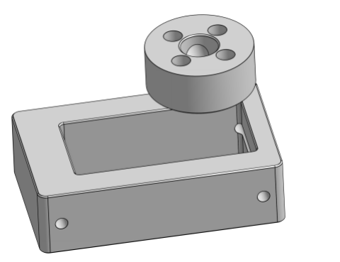

# LX-224 Servos

The [LX-16A](https://www.amazon.com/Hiwonder-LX-16A-Robotic-Controller-Control/dp/B073XY5NT1) was out of stock when I went to acquire my parts, so I ordered the very similar [LX-224](https://www.amazon.com/LX-224-Serial-Controller-Connectors-Bearing/dp/B0817YWHNL).o

I created a LX-224 bracket per the original design, see [my OnShape Sawppy Copy](https://cad.onshape.com/documents/7f40e51e085505c60163b9a8/w/9308f0417bc9c0c20e3ccf9f/e/5f2c482cad123d78f392508a?renderMode=0&uiState=68640591186ee449ddd21801), LX-224 branch, LX-224 Part Studio.

Since I've had problems with threads, and even threaded inserts, pulling out of plastic before, I also generated an alternative bracket in the same OnShape CAD, Bracked w Captured Nuts.  This is designed to be used with [M3x40mm screws](https://www.amazon.com/BNUOK-120pcs-Socket-Threads-Spanner/dp/B0DJQFXKHG/).

.png)