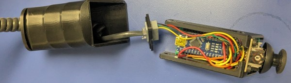

# Modifications made by Kevin Nickels, Trinity University

Dr. Nickels has made a TRIPPY - a variant of the Sawppy rover at Trinity University in San Antonio, TX.  He has made several minor modifications to the design during the build.   The name TRIPPY evolved from Trinity-SAWPPY, but could stand for "Trinity Robotics Instructional Planetary Platform".  It's purpose is to give Engineering students at Trinity University in San Antonio a robust platform to develop on top of, and to learn about the world of open-source hardware.

## LX-224 Servos

The [LX-16A](https://www.amazon.com/Hiwonder-LX-16A-Robotic-Controller-Control/dp/B073XY5NT1) was out of stock when I went to acquire my parts, so I ordered the very similar [LX-224](https://www.amazon.com/LX-224-Serial-Controller-Connectors-Bearing/dp/B0817YWHNL).  I created a LX-224 bracket per the original design, see [my OnShape Sawppy Copy](https://cad.onshape.com/documents/7f40e51e085505c60163b9a8/w/9308f0417bc9c0c20e3ccf9f/e/5f2c482cad123d78f392508a?renderMode=0&uiState=68640591186ee449ddd21801), LX-224 branch, LX-224 Part Studio.
 

Since I've had problems with threads, and even threaded inserts, pulling out of plastic before, I also generated an alternative bracket in the same OnShape CAD, Bracked w Captured Nuts.  This is designed to be used with [M3x40mm screws](https://www.amazon.com/BNUOK-120pcs-Socket-Threads-Spanner/dp/B0DJQFXKHG/).

## M3 SetScrews
As was mentioned in the Discussion section of [CJ - a sawppy variant](https://hackaday.io/project/165094-cj-a-sawppy-variant) on Hackaday, some of us have had issues with heat-set inserts pulling out.  As shown in this CAD and the pictures below, I ended up printing a Nut Carriage to get good strength and print resolution in the XY direction, then printing the knuckle in the standard orientation, so that the M3 nut won't spin when tightened against the flat in the 8mm shaft.  Then, I used an M3x16 screw as a setscrew instead of the tiny ones called out in the original.  We'll see how this holds up over time!

 

## Joystick Controller Modifications
I also modified the [Handheld Arduino Joystick controller](https://cad.onshape.com/documents/47ee84411a76e86eae57ea0f/w/f70ae835a2d548c4b95fa46e/e/c8538a52492e953cdcdd3db5?renderMode=0&uiState=6887d5ec43a024454e4cecf6) to accept an [RJ9](https://www.ebay.com/itm/317094616170) so that I can connect my controller to my rover with a standard coiled phone cord.

## Joystick Holster
Finally, I added a holster to the [Handheld Arduino Joystick controller](https://cad.onshape.com/documents/47ee84411a76e86eae57ea0f/w/f70ae835a2d548c4b95fa46e/e/d239459ff7d458760645b579?renderMode=0&uiState=6884005e8bb516261cb65b37) to accept an [RJ9](https://www.ebay.com/itm/317094616170) so that I can connect my controller to my rover with a standard coiled phone cord.